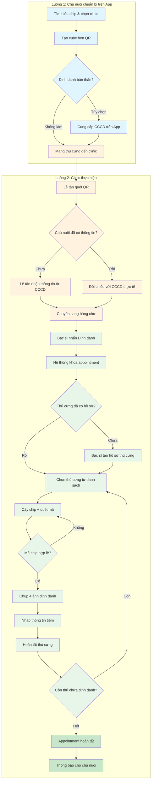
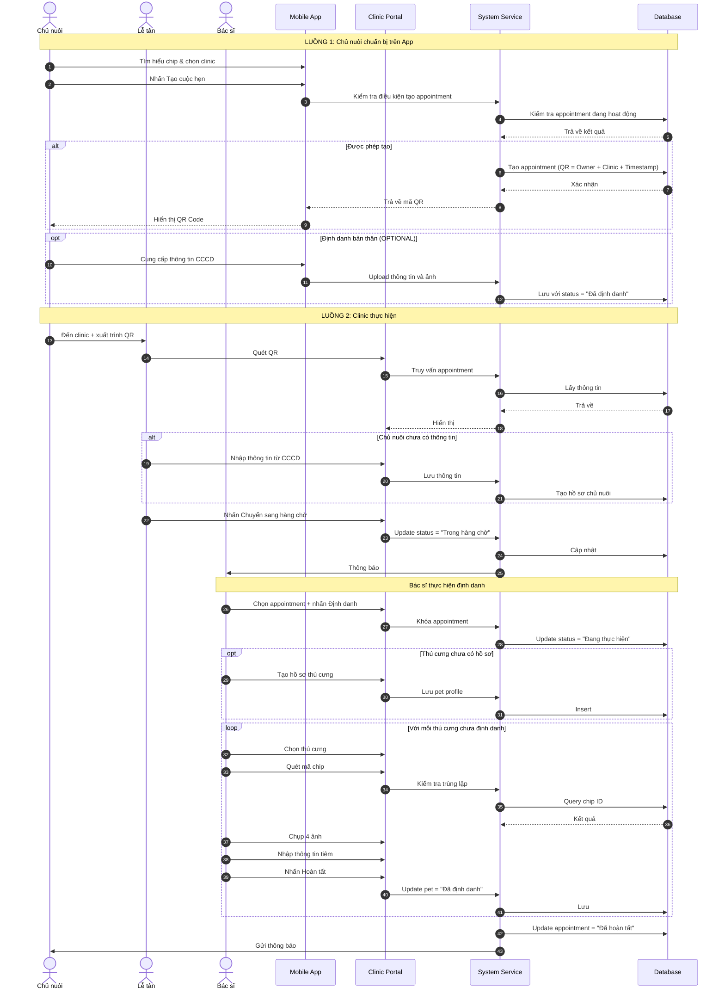

import { Steps } from "nextra/components";

# Quy trình đặt lịch hẹn & Định danh thú cưng

> Tài liệu này mô tả **quy trình nghiệp vụ** cho việc đặt lịch hẹn và định danh thú cưng tại clinic, áp dụng cho các vai trò: **Chủ nuôi (Pet Owner)**, **Lễ tân (Receptionist)** và **Bác sĩ (Doctor)**.

---

## Tổng quan 2 luồng nghiệp vụ

**Luồng 1: Chủ nuôi chuẩn bị trên App** (xanh dương)

- Tìm hiểu về chip định danh và chọn clinic
- Tạo cuộc hẹn (mã QR dựa trên Owner + Clinic + Thời điểm)
- Định danh bản thân (tùy chọn)

**Luồng 2: Clinic thực hiện** (cam + xanh lá)

- Lễ tân: Kiểm tra chủ nuôi → Chuyển sang hàng chờ
- Bác sĩ: Tạo hồ sơ thú cưng (nếu chưa có) → Định danh từng thú → Hoàn tất

---

## Luồng 1: Chủ nuôi chuẩn bị trên App

### Bước 1: Tìm hiểu về Chip định danh & Chọn Clinic

**Mục tiêu:** Giúp chủ nuôi hiểu về lợi ích chip định danh và tìm clinic phù hợp.

**Quy trình:**

1. Chủ nuôi mở App, vào mục "Phòng khám hỗ trợ"
2. Xem danh sách clinic trên bản đồ hoặc dạng list
3. Sử dụng bộ lọc: khoảng cách, đánh giá, dịch vụ, giờ làm việc
4. Xem chi tiết clinic: địa chỉ, SĐT, hình ảnh, đánh giá
5. Nhấn "Chọn clinic này" để tiếp tục

**Tham chiếu:** [US-OWN-07](./us-own-07)

### Bước 2: Tạo cuộc hẹn định danh (QR Code)

**Mục tiêu:** Tạo mã QR duy nhất để clinic nhận diện cuộc hẹn.

**Quy trình:**

1. Chủ nuôi chọn clinic muốn đến
2. Nhấn "Tạo cuộc hẹn" → Hệ thống sinh mã QR duy nhất dựa trên:
    - **Thông tin chủ nuôi** (đã đăng nhập)
    - **Clinic đã chọn**
    - **Thời điểm nhấn "Tạo cuộc hẹn"**
3. Lưu mã QR (chụp màn hình hoặc chia sẻ)

**Điểm khác biệt quan trọng:**

- ❌ **KHÔNG cần chọn thú cưng trước**
- ✅ Chủ nuôi sẽ mang **tất cả thú cưng cần định danh** đến clinic
- ✅ **Bác sĩ** sẽ hỗ trợ tạo hồ sơ thú cưng tại phòng khám (nếu chưa có)

**Trạng thái cuộc hẹn:**

| Trạng thái         | Ý nghĩa                                      |
| ------------------ | -------------------------------------------- |
| **Chờ đến**        | Mới tạo, chưa đến clinic                     |
| **Đã đến clinic**  | Lễ tân đã xác nhận check-in                  |
| **Trong hàng chờ** | Hồ sơ chủ nuôi đã kiểm tra, chờ bác sĩ       |
| **Đang thực hiện** | Bác sĩ đang thực hiện định danh              |
| **Đã hoàn tất**    | Tất cả thú cưng đã được định danh thành công |
| **Đã hủy**         | Cuộc hẹn bị hủy                              |

**Quy tắc nghiệp vụ:**

- Mã định danh có giá trị trong **4 ngày** kể từ ngày tạo
- Chỉ sử dụng tại **clinic đã chọn** khi tạo
- **Giới hạn:** Một chủ nuôi chỉ có tối đa **01 appointment hoạt động** tại một thời điểm
    - Không thể tạo appointment mới khi đang có appointment ở trạng thái: `Chờ đến`, `Đã đến clinic`, `Trong hàng chờ`, hoặc `Đang thực hiện`
    - Chỉ được tạo appointment mới khi appointment hiện tại đã ở trạng thái: `Đã hoàn tất`, `Đã hủy`, hoặc `Hết hạn`

**Tham chiếu:** [US-OWN-05](./us-own-05)

### Bước 3: Định danh bản thân (TÙY CHỌN)

**Mục tiêu:** Chủ nuôi cung cấp thông tin CCCD trên App để tiết kiệm thời gian tại clinic.

**Quy trình (nếu thực hiện):**

1. Vào mục "Định danh cá nhân" trong App
2. Nhập thông tin: họ tên, số CCCD, ngày cấp, nơi cấp, SĐT
3. Upload ảnh CCCD mặt trước và mặt sau
4. Hệ thống sử dụng OCR để xác thực thông tin
5. Nếu thành công → Trạng thái "Đã định danh"

**Tham chiếu:** [US-OWN-06](./us-own-06)

> **Lưu ý:** Đây là bước **TÙY CHỌN**. Nếu chủ nuôi chưa làm, lễ tân sẽ hỗ trợ xác minh và nhập thông tin trực tiếp tại clinic.

---

## Luồng 2: Clinic thực hiện

### Phần A: Lễ tân kiểm tra hồ sơ

#### A1. Check-in tại quầy lễ tân

**Quy trình:**

1. Chủ nuôi đến clinic, xuất trình mã QR hoặc đọc mã số định danh
2. Lễ tân quét mã hoặc tra cứu mã số
3. Hệ thống hiển thị thông tin appointment và chủ nuôi

#### A2. Xác minh danh tính chủ nuôi

**Trường hợp 1: Chủ nuôi đã cung cấp thông tin trên App**

- Lễ tân đối chiếu thông tin trên hệ thống với CCCD thực tế
- Nếu khớp → Xác nhận và tiếp tục
- Nếu không khớp → Lễ tân cập nhật thông tin

**Trường hợp 2: Chủ nuôi CHƯA cung cấp thông tin trên App**

- Lễ tân yêu cầu chủ nuôi xuất trình CCCD
- Lễ tân nhập thông tin mới vào hệ thống
- Chủ nuôi xác nhận thông tin đã nhập

> **Lưu ý:** Lễ tân **KHÔNG** tạo hồ sơ thú cưng. Việc này sẽ do **bác sĩ** thực hiện.

#### A3. Chuyển sang hàng chờ

**Quy trình:**

1. Lễ tân kiểm tra lại thông tin chủ nuôi
2. Nhấn "Chuyển sang hàng chờ"
3. Appointment chuyển từ "Chờ đến" → **"Trong hàng chờ"**
4. Hệ thống gửi thông báo đến bác sĩ

**Quy tắc nghiệp vụ:**

- Chỉ lễ tân mới có quyền kiểm tra và chuyển appointment sang "Trong hàng chờ"
- Lễ tân có thể cập nhật thông tin chủ nuôi tại clinic bằng cách yêu cầu xuất trình CCCD
- Chủ nuôi không thể tự chuyển appointment sang "Trong hàng chờ"

**Tham chiếu:** [US-CLI-04](./us-cli-04)

---

### Phần B: Bác sĩ thực hiện định danh

#### B1. Xem danh sách hàng chờ

- Bác sĩ kiểm tra danh sách appointment "Trong hàng chờ"
- Thông tin hiển thị: mã appointment, tên chủ nuôi, SĐT

#### B2. Thực hiện định danh

**Quy trình:**

1. Bác sĩ chọn appointment trong danh sách hàng chờ
2. Nhấn nút **"Định danh"**:
    - Hệ thống **khóa appointment** và gán cho bác sĩ
    - Ngăn các bác sĩ khác truy cập appointment này
    - Appointment chuyển sang "Đang thực hiện"

#### B3. Tạo hồ sơ thú cưng (nếu chưa có)

**Quy trình:**

1. Bác sĩ kiểm tra xem thú cưng đã có hồ sơ trong hệ thống chưa
2. Nếu chưa có → Bác sĩ tạo nhanh hồ sơ thú cưng tại phòng khám:
    - Tên thú cưng (có thể để tạm)
    - Loài (Species): Chó, Mèo, v.v.
    - Giống (Breed): Có thể chọn hoặc để "Không rõ"
    - Ảnh đại diện (tùy chọn, có thể chụp sau)
    - Ghi chú (nếu có)
3. Có thể tạo nhiều hồ sơ thú cưng cho cùng một chủ nuôi trong cùng appointment
4. Thú cưng mới tạo sẽ có trạng thái **"Chưa định danh"** và được thêm vào danh sách chờ định danh

#### B4. Định danh từng thú cưng

**Quy trình cho mỗi thú cưng:**

1. **Chọn thú cưng** từ danh sách "Chưa định danh"
2. **Cấy chip và quét mã chip**
3. **Kiểm tra trùng lặp mã chip** trên hệ thống
    - Nếu trùng → Cảnh báo, yêu cầu đổi chip
    - Nếu hợp lệ → Tiếp tục
4. **Chụp 4 ảnh định danh** (trực diện, góc trái, góc phải, đặc điểm)
5. **Nhập thông tin tiêm chủng**
6. **Nhấn "Hoàn tất định danh thú cưng này"**
7. Thú cưng chuyển từ "Chưa định danh" → **"Đã định danh"**
8. Hệ thống **quay lại danh sách** để chọn thú tiếp theo

#### B5. Hoàn tất appointment

- Khi tất cả thú cưng đã định danh → Appointment chuyển sang **"Đã hoàn tất"**
- Hệ thống gửi thông báo cho chủ nuôi
- Dữ liệu được đồng bộ lên hệ thống

**Quy tắc nghiệp vụ:**

- Chỉ bác sĩ mới có quyền thực hiện định danh
- **Bác sĩ có quyền tạo hồ sơ thú cưng mới** (lễ tân không làm việc này)
- Mỗi thú cưng phải có đủ 4 ảnh định danh mới được hoàn tất
- Mã chip phải là duy nhất trên toàn hệ thống
- Khi bác sĩ nhấn "Định danh", hệ thống khóa appointment chống trùng lặp
- Sau khi hoàn tất một thú cưng, hệ thống tự động quay lại danh sách để chọn thú tiếp theo

**Tham chiếu:** [US-CLI-05](./us-cli-05)

---

## Sơ đồ trình tự tổng quát

---

## Trạng thái Appointment

| Trạng thái         | Mô tả                                  | Vai trò chuyển                     |
| ------------------ | -------------------------------------- | ---------------------------------- |
| **Chờ đến**        | Appointment mới tạo, chưa đến clinic   | Chủ nuôi tạo trên App              |
| **Đã đến clinic**  | Lễ tân đã xác nhận check-in            | Lễ tân quét QR                     |
| **Trong hàng chờ** | Hồ sơ chủ nuôi đã kiểm tra, chờ bác sĩ | Lễ tân nhấn "Chuyển sang hàng chờ" |
| **Đang thực hiện** | Bác sĩ đang thực hiện định danh        | Bác sĩ nhấn "Định danh"            |
| **Đã hoàn tất**    | Tất cả thú cưng đã định danh           | Hệ thống tự động                   |
| **Đã hủy**         | Appointment bị hủy                     | Chủ nuôi trên App                  |

---

## Tài liệu tham khảo

- [US-OWN-05: Tạo cuộc hẹn định danh thú cưng](./us-own-05)
- [US-OWN-06: Định danh bản thân (TÙY CHỌN)](./us-own-06)
- [US-OWN-07: Tìm hiểu về Chip định danh & Phòng khám hỗ trợ](./us-own-07)
- [US-CLI-04: Lễ tân - Kiểm tra hồ sơ chủ nuôi](./us-cli-04)
- [US-CLI-05: Bác sĩ - Thực hiện cấy chip và hoàn thiện hồ sơ](./us-cli-05)
