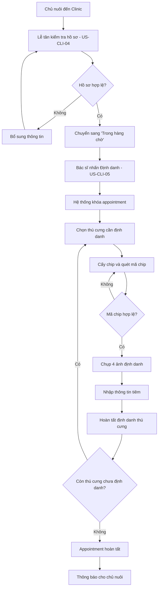

import { Steps } from "nextra/components";

# Quy trình định danh thú cưng tại Clinic

> Quy trình dưới đây áp dụng cho luồng định danh tại Clinic, được chia thành **3 giai đoạn**: **Chủ nuôi chuẩn bị**, **Lễ tân kiểm tra hồ sơ** và **Bác sĩ thực hiện định danh**.

---

## Tổng quan quy trình

Quy trình định danh bao gồm các giai đoạn chính:

1. **Chủ nuôi chuẩn bị (Trước khi đến clinic):**
    - Tìm hiểu về chip định danh và chọn clinic → [US-OWN-07](../user-stories/us-own-07)
    - Tạo mã định danh (QR) cho thú cưng → [US-OWN-05](../user-stories/us-own-05)
    - Định danh bản thân (cung cấp CCCD) → [US-OWN-06](../user-stories/us-own-06) **(TÙY CHỌN)**

2. **Lễ tân kiểm tra hồ sơ (Tại clinic):**
    - Xác minh danh tính chủ nuôi (nếu chưa có thông tin, lễ tân sẽ nhập mới)
    - Kiểm tra và xác thực thông tin → [US-CLI-04](../user-stories/us-cli-04)
    - Chuyển appointment sang "Trong hàng chờ"

3. **Bác sĩ thực hiện định danh:**
    - Cấy chip, chụp ảnh, hoàn tất hồ sơ → [US-CLI-05](../user-stories/us-cli-05)

---

## Giai đoạn 1: Lễ tân kiểm tra hồ sơ (US-CLI-04)

<Steps>

### Chủ nuôi đến Clinic

Chủ nuôi đến clinic theo lịch hẹn đã đặt trước. Lễ tân đón tiếp và tìm kiếm appointment của chủ nuôi trong hệ thống.

### Kiểm tra thông tin chủ nuôi

Lễ tân đối chiếu thông tin chủ nuôi với giấy tờ tùy thân (CCCD):

**Nếu chủ nuôi đã cung cấp thông tin trên App trước:**

- Lễ tân kiểm tra và đối chiếu với CCCD thực tế
- Họ tên (theo CCCD)
- Số CCCD
- Số điện thoại
- Ảnh CCCD (mặt trước, mặt sau)

**Nếu chủ nuôi CHƯA cung cấp thông tin trên App:**

- Lễ tân yêu cầu chủ nuôi xuất trình CCCD
- Lễ tân nhập thông tin mới vào hệ thống
- Chủ nuôi xác nhận thông tin đã nhập

### Xử lý hồ sơ chưa hợp lệ

Nếu thông tin chưa đầy đủ hoặc không khớp với thực tế:

- Yêu cầu chủ nuôi bổ sung thông tin
- Hỗ trợ chủ nuôi cập nhật thông tin trên hệ thống

> **Lưu ý quan trọng:** Lễ tân có thể cập nhật profile của chủ thú cưng tại clinic bằng cách yêu cầu chủ nuôi xuất trình CCCD để xác minh. Không cần phải qua bước định danh trên App trước.

### Chuyển sang hàng chờ

Khi hồ sơ đã hợp lệ, lễ tân nhấn nút **"Chuyển sang hàng chờ"**:

- Appointment chuyển từ trạng thái **"Chờ đến"** sang **"Trong hàng chờ"**
- Hệ thống gửi thông báo đến bác sĩ về appointment mới trong hàng chờ
- Appointment xuất hiện trong danh sách "Trong hàng chờ" của bác sĩ

> **Quy tắc nghiệp vụ:**
>
> - Chỉ lễ tân mới có quyền kiểm tra và chuyển appointment sang "Trong hàng chờ"
> - Appointment chỉ được chuyển sang "Trong hàng chờ" khi thông tin chủ nuôi đã được xác thực (đã có trên App hoặc lễ tân nhập mới tại clinic)
> - Chủ nuôi không thể tự chuyển appointment sang "Trong hàng chờ"
> - Lễ tân có thể cập nhật thông tin chủ nuôi tại clinic bằng cách yêu cầu xuất trình CCCD

</Steps>

---

## Giai đoạn 2: Bác sĩ thực hiện định danh (US-CLI-05)

<Steps>

### Xem danh sách hàng chờ

Bác sĩ kiểm tra danh sách appointment đang ở trạng thái "Trong hàng chờ":

- Mã appointment
- Tên chủ nuôi
- Số điện thoại
- Số lượng thú cưng cần định danh
- Thời gian chờ

### Thực hiện định danh

Bác sĩ chọn một appointment trong danh sách hàng chờ và nhấn nút **"Định danh"**:

- Hệ thống **khóa appointment** và gán cho bác sĩ đang xử lý
- Appointment chuyển sang trạng thái **"Đang thực hiện"**
- **Ngăn các bác sĩ khác** không thể thực hiện định danh trên cùng appointment này
- Hiển thị thông tin chi tiết về chủ nuôi và thú cưng cần định danh

> **Quy tắc chống trùng lặp:** Khi bác sĩ nhấn "Định danh", nếu appointment đã bị khóa bởi bác sĩ khác, hệ thống sẽ hiển thị thông báo: _"Appointment đang được xử lý bởi bác sĩ [tên]"_.

### Chọn thú cưng cần định danh

Chỉ chọn các thú cưng đang ở trạng thái **Chưa định danh**. Nếu khách có thêm thú cưng chưa có trên hệ thống, tạo nhanh hồ sơ cơ bản để tiếp tục xử lý.

### Cấy chip cho thú cưng

Sử dụng kim tiêm chuyên dụng để đưa chip vào dưới da (thường là vùng giữa hai xương bả vai). Thao tác cần đúng kỹ thuật và đúng quy trình an toàn.

### Nhập và xác thực mã Chip ID

Quét hoặc nhập tay `Chip ID`, sau đó kiểm tra trùng lặp trên toàn hệ thống:

- Nếu mã chip đã tồn tại: Hiển thị cảnh báo **"Mã chip đã tồn tại trên hệ thống"**, không cho phép lưu và yêu cầu đổi chip hợp lệ
- Nếu mã chip hợp lệ: Tiếp tục quy trình

### Chụp ảnh định danh

Chụp **4 ảnh bắt buộc** cho mỗi thú cưng:

1. **Ảnh trực diện (Face):** Chụp mặt thú cưng
2. **Ảnh góc trái (Left side):** Chụp bên trái thú cưng
3. **Ảnh góc phải (Right side):** Chụp bên phải thú cưng
4. **Ảnh đặc điểm nhận dạng (Special marks):** Chụp các đặc điểm đặc biệt (nốt ruồi, sẹo, v.v.)

Hệ thống yêu cầu xác nhận chất lượng ảnh trước khi lưu.

### Nhập thông tin tiêm

Hoàn thiện thông tin tiêm cho thú cưng:

- **Ngày tiêm:** Tự động điền ngày hiện tại hoặc cho phép chỉnh sửa
- **Giờ tiêm:** Tự động điền giờ hiện tại hoặc cho phép chỉnh sửa
- **Nhân sự thực hiện:** Tự động điền tên bác sĩ thực hiện

### Hoàn tất định danh thú cưng

Kiểm tra lại toàn bộ thông tin:

- Mã chip
- Ảnh định danh
- Thông tin tiêm
- Nhân sự thực hiện

Sau đó nhấn nút **"Hoàn tất định danh thú cưng này"**:

- Thú cưng chuyển từ trạng thái **"Chưa định danh"** sang **"Đã định danh"**
- Hệ thống lưu trữ lịch sử định danh bao gồm: bác sĩ thực hiện, thời gian, và các ảnh định danh

> **Quy tắc nghiệp vụ:**
>
> - Mỗi thú cưng phải có đủ 4 ảnh định danh mới được hoàn tất
> - Mã chip phải là duy nhất trên toàn hệ thống
> - Khi thú cưng đã được định danh, không thể thay đổi mã chip hoặc ảnh định danh

### Xử lý nhiều thú cưng

Nếu có nhiều thú cưng trong cùng appointment:

- **Từng thú cưng:** Mỗi thú cưng được xử lý riêng biệt, có thể hoàn tất từng con một
- **Hoàn tất toàn bộ:** Khi tất cả thú cưng trong appointment đã được định danh, appointment chuyển sang trạng thái **"Đã hoàn tất"**

### Đồng bộ và thông báo cho chủ nuôi

Sau khi hoàn tất toàn bộ appointment:

- Hệ thống cập nhật trạng thái appointment sang **"Đã hoàn tất"**
- Đồng bộ dữ liệu về App
- Gửi thông báo cho chủ nuôi về việc định danh đã hoàn tất

</Steps>

---

## Sơ đồ quy trình tổng quát

