import { Steps } from "nextra/components";

# Tổng Quan Định Danh Thú Cưng Tại Clinic

## Tổng quan quy trình

Quy trình định danh bao gồm **2 luồng chính**:

### Luồng 1: Chủ nuôi chuẩn bị trên App

1. **Tìm hiểu về chip & chọn clinic** → [US-OWN-07](/user-stories/OWN/us-own-07)
2. **Tạo cuộc hẹn (mã QR)** → [US-OWN-05](/user-stories/OWN/us-own-05)
   - QR dựa trên: Chủ nuôi + Clinic + Thời điểm
   - **KHÔNG cần chọn thú cưng trước**
3. **Định danh bản thân (TÙY CHỌN)** → [US-OWN-06](/user-stories/OWN/us-own-06)
   - Cung cấp CCCD, họ tên, SĐT trên App
   - Nếu không làm → Lễ tân sẽ nhập tại clinic

### Luồng 2: Clinic thực hiện

**Phần A: Lễ tân kiểm tra hồ sơ** → [US-CLI-04](/user-stories/CLI/us-cli-04)

1. Quét QR hoặc tra cứu mã hẹn
2. Xác minh CCCD thực tế
3. Nếu chưa có thông tin → Lễ tân nhập mới
4. Nhấn **"Chuyển sang hàng chờ"** → Appointment `Chờ đến` → `Trong hàng chờ`

**Phần B: Bác sĩ thực hiện định danh** → [US-CLI-05](/user-stories/CLI/us-cli-05)

1. Chọn appointment từ hàng chờ, nhấn **"Định danh"**
   - Hệ thống **khóa appointment** cho bác sĩ này
2. **Tạo hồ sơ thú cưng** (nếu chưa có)
   - Tên, loài, giống, ghi chú
   - Trạng thái: `Chưa định danh`
3. **Định danh từng thú cưng:**
   - Cấy chip + quét mã
   - Kiểm tra trùng lặp Chip ID
   - Chụp **4 ảnh**: trực diện, trái, phải, đặc điểm
   - Nhập thông tin tiêm
   - Nhấn **"Hoàn tất"** → Thú cưng `Chưa định danh` → `Đã định danh`
4. Lặp lại cho đến khi hết thú cưng
5. Appointment → `Đã hoàn tất`, hệ thống thông báo cho chủ nuôi

---

## Sơ đồ quy trình

```mermaid
flowchart TD
    subgraph Luồng 1: Chủ nuôi chuẩn bị
        A1[Tìm hiểu chip & chọn clinic] --> A2[Tạo cuộc hẹn QR]
        A2 --> A3{Định danh bản thân?}
        A3 -->|Tùy chọn| A4[Cung cấp CCCD trên App]
        A3 -->|Không| A5[Mang thú cưng đến clinic]
        A4 --> A5
    end

    subgraph Luồng 2: Clinic thực hiện
        A5 --> B1[Lễ tân quét QR]
        B1 --> B2{Chủ nuôi đã có thông tin?}
        B2 -->|Chưa| B3[Lễ tân nhập từ CCCD]
        B2 -->|Rồi| B4[Đối chiếu với CCCD]
        B3 --> B5[Chuyển sang hàng chờ]
        B4 --> B5
        B5 --> C1[Bác sĩ nhấn Định danh]
        C1 --> C2[Hệ thống khóa appointment]
        C2 --> C3{Thú cưng đã có hồ sơ?}
        C3 -->|Chưa| C4[Bác sĩ tạo hồ sơ]
        C3 -->|Rồi| C5[Chọn thú cưng]
        C4 --> C5
        C5 --> C6[Cấy chip + quét mã]
        C6 --> C7{Mã chip hợp lệ?}
        C7 -->|Không| C6
        C7 -->|Có| C8[Chụp 4 ảnh]
        C8 --> C9[Nhập thông tin tiêm]
        C9 --> C10[Hoàn tất thú cưng]
        C10 --> C11{Còn thú chưa định danh?}
        C11 -->|Còn| C5
        C11 -->|Hết| D1[Appointment hoàn tất]
        D1 --> D2[Thông báo chủ nuôi]
    end

    style A1 fill:#e1f5ff
    style A2 fill:#e1f5ff
    style A3 fill:#e1f5ff
    style A4 fill:#e1f5ff
    style A5 fill:#fff3e0
    style B1 fill:#fff3e0
    style B2 fill:#fff3e0
    style B3 fill:#fff3e0
    style B4 fill:#fff3e0
    style B5 fill:#fff3e0
    style C1 fill:#e8f5e9
    style C2 fill:#e8f5e9
    style C3 fill:#e8f5e9
    style C4 fill:#e8f5e9
    style C5 fill:#e8f5e9
    style C6 fill:#e8f5e9
    style C7 fill:#e8f5e9
    style C8 fill:#e8f5e9
    style C9 fill:#e8f5e9
    style C10 fill:#e8f5e9
    style C11 fill:#e8f5e9
    style D1 fill:#c8e6c9
    style D2 fill:#c8e6c9
```

---

## Trạng thái Appointment

| Trạng thái | Ý nghĩa | Vai trò chuyển |
|-----------|---------|---------------|
| `Chờ đến` | Mới tạo, chưa đến clinic | Chủ nuôi tạo trên App |
| `Đã đến clinic` | Lễ tân đã check-in | Lễ tân quét QR |
| `Trong hàng chờ` | Đã xác minh, chờ bác sĩ | Lễ tân nhấn "Chuyển sang hàng chờ" |
| `Đang thực hiện` | Bác sĩ đang định danh | Bác sĩ nhấn "Định danh" |
| `Đã hoàn tất` | Tất cả thú cưng đã định danh | Hệ thống tự động |
| `Đã hủy` | Cuộc hẹn bị hủy | Chủ nuôi/Admin |

---

## Quy tắc nghiệp vụ quan trọng

> [!WARNING]
> - **Một chủ nuôi chỉ có tối đa 01 appointment hoạt động** tại một thời điểm
> - **Lễ tân KHÔNG tạo hồ sơ thú cưng** → Việc này do **bác sĩ** thực hiện
> - Khi bác sĩ nhấn "Định danh", hệ thống **khóa appointment** chống trùng lặp
> - **Mỗi thú cưng phải có đủ 4 ảnh** mới được hoàn tất
> - **Mã chip phải là duy nhất** trên toàn hệ thống

---

## Tài liệu chi tiết

- **US-OWN-05:** [Tạo cuộc hẹn định danh](/user-stories/OWN/us-own-05)
- **US-OWN-06:** [Định danh bản thân (tùy chọn)](/user-stories/OWN/us-own-06)
- **US-OWN-07:** [Tìm hiểu chip & phòng khám](/user-stories/OWN/us-own-07)
- **US-CLI-04:** [Lễ tân - Kiểm tra hồ sơ](/user-stories/CLI/us-cli-04)
- **US-CLI-05:** [Bác sĩ - Cấy chip & hoàn tất](/user-stories/CLI/us-cli-05)
