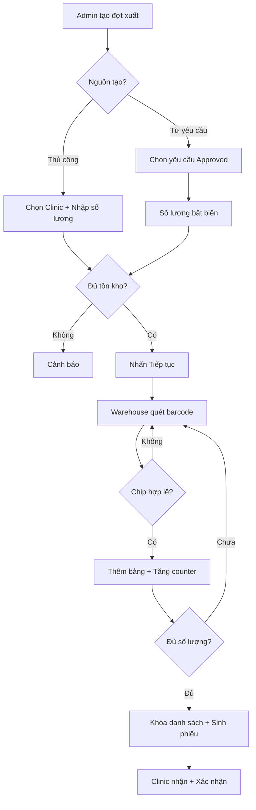

import { Steps } from "nextra/components";

# Tổng Quan Nhập - Xuất Kho Chip (Ký Gửi)

## Tổng quan quy trình

Quy trình nhập - xuất chip bao gồm **3 giai đoạn chính**:

### 1️⃣ Nhập kho chip từ nhà máy

**Mục tiêu:** Import danh sách chip từ nhà máy vào kho TMT

1. Admin upload file Excel (Model, ID, SN No., Expiry Date)
2. Hệ thống validate: cấu trúc, trùng lặp, định dạng
3. Preview → Admin xác nhận
4. Tạo chip với trạng thái `Available`

📖 **Chi tiết:** [US-ADM-06](/user-stories/ADM/us-adm-06)

---

### 2️⃣ Tạo đợt xuất ký gửi

**Mục tiêu:** Xuất chip từ kho TMT đến Clinic theo đợt

**Có 2 nguồn tạo đợt:**

| Nguồn | Mô tả |
|-------|-------|
| **Thủ công (Push)** | Admin tự chọn Clinic và nhập số lượng |
| **Từ yêu cầu (Pull)** | Admin chọn yêu cầu `Approved` từ Clinic, số lượng **bất biến** |

**Các bước:**
1. Admin chọn Clinic → nhập số lượng (không bắt buộc bội số của 5)
2. Kiểm tra tồn kho `Available` đủ không
3. Nhấn **"Tiếp tục"** → tạo đơn xuất ký gửi cho từng Clinic
4. Warehouse mở dialog quét barcode cho từng Clinic

📖 **Chi tiết:** [US-ADM-07](/user-stories/ADM/us-adm-07), [US-ADM-09](/user-stories/ADM/us-adm-09)

---

### 3️⃣ Quét chip xuất kho

**Mục tiêu:** Warehouse quét từng chip để xác định chính xác chip nào xuất

**Quy trình quét:**
1. Quét barcode → hệ thống validate realtime
2. **Hợp lệ:** Thêm hàng vào bảng + tăng counter +1
3. **Không hợp lệ:** Báo lỗi, từ chối
4. Quét đủ → tự động khóa danh sách → sinh phiếu xuất

**⭐ Xóa chip đã quét:**
- Nhấn nút **[Xóa]** cạnh hàng trong bảng
- Chip xóa khỏi bảng, counter giảm -1, chip quay lại `Available`
- **Ràng buộc:** Chỉ xóa khi đơn xuất chưa bàn giao (`Pending Scan` hoặc `Scanning`)

📖 **Chi tiết:** [US-ADM-07](/user-stories/ADM/us-adm-07)

---

### 4️⃣ Clinic nhận chip

**Mục tiêu:** Clinic kiểm tra và xác nhận nhận chip

| Trường hợp | Hành động | Kết quả |
|------------|-----------|---------|
| **Nhận đủ** | Clinic xác nhận | Đơn xuất → `Fully Received`, chip → `In-Clinic` |
| **Nhận thiếu** | Clinic báo thiếu | Đơn xuất → `Partially Received`, TMT gửi bù sau |

📖 **Chi tiết:** [US-CLI-03](/user-stories/CLI/us-cli-03)

---

## Sơ đồ luồng xuất kho

---

## Trạng thái đơn xuất ký gửi (Per Clinic)

| Trạng thái | Ý nghĩa |
|-----------|---------|
| `Pending Scan` | Chưa bắt đầu quét |
| `Scanning` | Đang quét chip |
| `Completed` | Đã quét đủ số lượng |
| `Partially Received` | Clinic nhận nhưng báo thiếu |
| `Fully Received` | Clinic xác nhận nhận đủ |
| `Cancelled` | Đơn xuất bị hủy |

---

## Quy trình yêu cầu nhận ký gửi

**Mục tiêu:** Clinic chủ động tạo yêu cầu nhận chip

1. Clinic tạo yêu cầu (số lượng, lý do, ngày mong nhận)
2. **Ràng buộc:** Chỉ **một yêu cầu pending** tại một thời điểm
3. Admin xử lý:
   - **Duyệt:** Xác nhận số lượng (có thể điều chỉnh) → `Approved`
   - **Từ chối:** Nhập lý do → `Rejected`
   - **Đưa vào đợt xuất:** Chọn/tạo đợt xuất → `In Export Round`
4. Warehouse quét chip → Clinic nhận → Yêu cầu → `Fulfilled`

📖 **Chi tiết:** [US-CLI-08](/user-stories/CLI/us-cli-08), [US-ADM-09](/user-stories/ADM/us-adm-09)

---

## Xử lý sự cố chip

**Mục tiêu:** Quản lý các trạng thái Problem/Returned

| Trạng thái | Ý nghĩa | Người thực hiện |
|-----------|---------|----------------|
| `Problem by Clinic` | Hỏng/mất tại Clinic | Admin |
| `Problem by TMT` | Hỏng/mất tại TMT | Admin |
| `Problem by Factory` | Lỗi từ nhà máy | Admin |
| `Returned` | Trả chip về kho TMT | Admin |

📖 **Chi tiết:** [problem.mdx](./problem)

---

## Tài liệu tham khảo

### User Stories
- [US-ADM-06: Nhập kho](/user-stories/ADM/us-adm-06)
- [US-ADM-07: Xuất kho ký gửi](/user-stories/ADM/us-adm-07)
- [US-ADM-09: Xử lý yêu cầu ký gửi](/user-stories/ADM/us-adm-09)
- [US-CLI-03: Tồn kho Clinic](/user-stories/CLI/us-cli-03)
- [US-CLI-08: Tạo yêu cầu nhận ký gửi](/user-stories/CLI/us-cli-08)

### Tài liệu chi tiết
- [problem.mdx](./problem) - Xử lý sự cố chip
