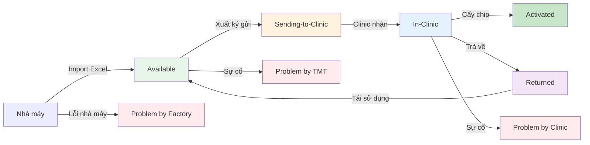

import { Steps } from "nextra/components";

# Tổng Quan Hệ Thống Chip Định Danh

## 2 Quy Trình Chính

### 📦 Quy Trình 1: Nhập - Xuất Kho Chip (Ký Gửi)

Quản lý vòng đời chip từ khi nhập kho đến khi xuất cho Clinic:

```
Nhà máy → Nhập kho (Available) → Tạo đợt xuất → Warehouse quét barcode → Clinic nhận chip
                                                                    ↓
                                                            Problem/Returned
```

**Các bước chính:**

1. **Nhập kho:** Admin import file Excel từ nhà máy → chip `Available`
2. **Tạo yêu cầu:** Clinic tạo yêu cầu nhận chip (số lượng, lý do)
3. **Tạo đợt xuất:** Admin chọn Clinic hoặc chọn yêu cầu `Approved`
4. **Quét barcode:** Warehouse quét từng chip, hệ thống validate realtime
5. **Bàn giao:** Clinic nhận và xác nhận đủ/thiếu

📖 **Xem chi tiết:** [Nhập - Xuất kho](./nhap-xuat/tong-quan)

---

### 🏥 Quy Trình 2: Định Danh Thú Cưng (Tại Clinic)

Quy trình cấy chip và định danh thú cưng tại phòng khám:

```
Chủ nuôi tạo hẹn (QR) → Lễ tân check-in → Bác sĩ cấy chip → Hoàn tất
```

**Các bước chính:**

1. **Chủ nuôi chuẩn bị:** Tạo cuộc hẹn QR trên App, tùy chọn định danh bản thân
2. **Lễ tân kiểm tra:** Quét QR, xác minh CCCD, chuyển sang hàng chờ
3. **Bác sĩ thực hiện:** Tạo hồ sơ thú (nếu chưa có), cấy chip, chụp 4 ảnh, nhập thông tin tiêm

📖 **Xem chi tiết:** [Định danh thú cưng](./dinh-danh/tong-quan)

---

## Vòng Đời Chip



---

## Trạng Thái Chip

| Trạng thái           | Ý nghĩa                     | Vai trò quản lý |
| -------------------- | --------------------------- | --------------- |
| `Available`          | Chip có sẵn tại kho TMT     | Admin/Warehouse |
| `Sending-to-Clinic`  | Đang gửi đến Clinic         | Admin/Warehouse |
| `In-Clinic`          | Đã đến Clinic, chưa sử dụng | Clinic          |
| `Activated`          | Đã cấy cho thú cưng         | Clinic          |
| `Returning`          | Đang trả về kho TMT         | Clinic          |
| `Returned`           | Đã về kho TMT               | Admin/Warehouse |
| `Problem by Clinic`  | Sự cố tại Clinic            | Admin           |
| `Problem by TMT`     | Sự cố tại TMT               | Admin           |
| `Problem by Factory` | Lỗi từ nhà máy              | Admin           |

---

## Trạng Thái Đơn Xuất Ký Gửi (Per Clinic)

Mỗi Clinic trong đợt xuất có **một đơn xuất** với trạng thái riêng:

| Trạng thái           | Ý nghĩa                     |
| -------------------- | --------------------------- |
| `Pending Scan`       | Chưa bắt đầu quét           |
| `Scanning`           | Đang quét chip              |
| `Completed`          | Đã quét đủ số lượng         |
| `Partially Received` | Clinic nhận nhưng báo thiếu |
| `Fully Received`     | Clinic xác nhận nhận đủ     |
| `Cancelled`          | Đơn xuất bị hủy             |

---

## Trạng Thái Cuộc Hẹn Định Danh

| Trạng thái       | Ý nghĩa                           | Vai trò chuyển                     |
| ---------------- | --------------------------------- | ---------------------------------- |
| `Chờ đến`        | Mới tạo, chưa đến clinic          | Chủ nuôi tạo trên App              |
| `Đã đến clinic`  | Lễ tân đã check-in                | Lễ tân quét QR                     |
| `Trong hàng chờ` | Đã xác minh thông tin, chờ bác sĩ | Lễ tân nhấn "Chuyển sang hàng chờ" |
| `Đang thực hiện` | Bác sĩ đang định danh             | Bác sĩ nhấn "Định danh"            |
| `Đã hoàn tất`    | Tất cả thú cưng đã định danh      | Hệ thống tự động                   |
| `Đã hủy`         | Cuộc hẹn bị hủy                   | Chủ nuôi/Admin                     |

---

## Thuật Ngữ Quan Trọng

| Thuật ngữ                          | Giải thích                                                               |
| ---------------------------------- | ------------------------------------------------------------------------ |
| **Đợt xuất (Export Round)**        | Tập hợp nhiều đơn xuất được tạo cùng lúc bởi Admin                       |
| **Đơn xuất ký gửi (Export Order)** | Yêu cầu xuất chip cho **một Clinic** trong đợt xuất                      |
| **Ký gửi (Consignment)**           | Mô hình gửi chip đến Clinic, chip vẫn thuộc sở hữu TMT đến khi kích hoạt |
| **SN No. (Serial Number)**         | Mã định danh duy nhất cho mỗi chip, in trên barcode                      |
| **Push**                           | Admin chủ động xuất chip cho Clinic theo kế hoạch                        |
| **Pull**                           | Clinic tạo yêu cầu, Admin xử lý theo nhu cầu thực tế                     |
