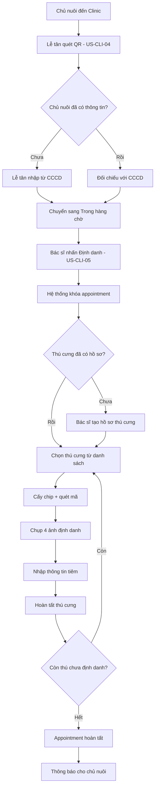

# Danh sách User Stories

## US (Mới): Nhập - Xuất Kho

| Mã US                              | Tên US                | Mô tả ngắn                                                                                   |
| ---------------------------------- | --------------------- | -------------------------------------------------------------------------------------------- |
| [US-ADM-06](./nhap-xuat/us-adm-06) | Nhập kho chip         | Admin nhập file Excel để tạo chip ở trạng thái `Available`.                                  |
| [US-ADM-07](./nhap-xuat/us-adm-07) | Ký gửi chip hàng loạt | Admin tạo đợt ký gửi, nhập số lượng theo từng Clinic và hệ thống tự sinh danh sách `SN No.`. |
| [US-CLI-03](./nhap-xuat/us-cli-03) | Tồn kho tại Clinic    | Clinic quản lý tồn kho chip, theo dõi sử dụng, báo cáo sự cố và trả chip về kho tổng.        |

---

## US (Cũ): Định danh

> **Lưu ý:** Các US định danh cũ được lưu trữ để tham khảo. Quy trình mới đã được cập nhật trong phần "US (Mới): Định danh cải tiến".
>
> **Đặc điểm quy trình cũ:** Mỗi người dùng phải hoàn thành **tất cả các bước** trong phần việc của mình trước khi chuyển sang người tiếp theo (tuần tự hoàn toàn).

| Mã US     | Tên US                                                                                                                                        | Mô tả ngắn                                                                                                             |
| --------- | --------------------------------------------------------------------------------------------------------------------------------------------- | ---------------------------------------------------------------------------------------------------------------------- |
| US-OWN-05 | [Tạo mã xác nhận định danh thú cưng](https://pickled-anger-a3d.notion.site/US-OWN-05-32a7da1c93ba80b79b24eaf16ce5439c)                        | Chủ nuôi chọn Clinic và tạo mã định danh (QR) để clinic quét và thực hiện quy trình gắn chip.                          |
| US-OWN-06 | [Định danh bản thân (bản cùi bắp)](https://pickled-anger-a3d.notion.site/US-OWN-06-32a7da1c93ba8060a4f7c94fe40b62e2?pvs=74)                   | Chủ nuôi cung cấp thông tin định danh cá nhân (Họ tên, CCCD) để hoàn thiện hồ sơ pháp lý trước khi định danh thú cưng. |
| US-OWN-07 | [Tìm hiểu về Chip định danh & Các phòng khám hỗ trợ](https://pickled-anger-a3d.notion.site/US-OWN-07-32a7da1c93ba80f998c2dee57987484a?pvs=74) | Chủ nuôi xem thông tin về lợi ích chip định danh và tìm kiếm danh sách phòng khám hỗ trợ dịch vụ.                      |
| US-CLI-01 | [Quản lý danh sách hẹn định danh](https://pickled-anger-a3d.notion.site/US-CLI-01-32a7da1c93ba8056a91bfa6159095aec?pvs=74)                    | Nhân viên clinic theo dõi danh sách chủ nuôi đã chọn clinic để chuẩn bị thiết bị và thực hiện định danh.               |
| US-CLI-02 | [Quy trình định danh Chip thú cưng (3 Bước)](https://pickled-anger-a3d.notion.site/US-CLI-02-32a7da1c93ba80088431df344ef6d722?pvs=74)         | Nhân viên clinic thực hiện quy trình định danh khép kín từ kiểm tra thông tin chủ nuôi đến gắn chip vật lý.            |

---

## US (Mới): Định danh cải tiến

> **Cải tiến chính:**
>
> - **Mã QR dựa trên:** Chủ nuôi + Clinic + Thời điểm tạo hẹn (không cần chọn thú cưng trước)
> - **Chủ nuôi mang thú cưng đến clinic:** Bác sĩ sẽ hỗ trợ tạo hồ sơ thú cưng tại phòng khám (nếu chưa có)
> - Bổ sung trạng thái **"Trong hàng chờ"** cho appointment (đã đến clinic)
> - Tách quy trình thành 2 phần rõ ràng:
>     1. **Lễ tân (US-CLI-04):** Kiểm tra chủ nuôi → Chuyển sang "Trong hàng chờ"
>     2. **Bác sĩ (US-CLI-05):** Tạo hồ sơ thú cưng (nếu chưa có) → Định danh từng thú cưng
> - **Cơ chế khóa appointment:** Khi bác sĩ nhấn "Định danh", hệ thống khóa appointment và ngăn các bác sĩ khác thực hiện trùng lặp
> - **Định danh bản thân (US-OWN-06):** Tùy chọn, không bắt buộc

| Mã US                              | Tên US                                                               | Mô tả ngắn                                                                                                               |
| ---------------------------------- | -------------------------------------------------------------------- | ------------------------------------------------------------------------------------------------------------------------ |
| [US-OWN-05](./dinh-danh/us-own-05) | Tạo cuộc hẹn định danh thú cưng                                      | Chủ nuôi chọn Clinic và tạo cuộc hẹn (mã QR dựa trên Owner + Clinic + Thời điểm). Không cần chọn thú cưng trước.         |
| [US-OWN-06](./dinh-danh/us-own-06) | Định danh bản thân (TÙY CHỌN)                                        | Chủ nuôi cung cấp thông tin định danh cá nhân (Họ tên, CCCD) trên App để tiết kiệm thời gian tại clinic. Không bắt buộc. |
| [US-OWN-07](./dinh-danh/us-own-07) | Tìm hiểu về Chip định danh & Các phòng khám hỗ trợ                   | Chủ nuôi xem thông tin về lợi ích chip định danh và tìm kiếm danh sách phòng khám hỗ trợ dịch vụ.                        |
| [US-CLI-04](./dinh-danh/us-cli-04) | [Lễ tân - Kiểm tra hồ sơ chủ nuôi](./dinh-danh/us-cli-04)            | Lễ tân kiểm tra chủ nuôi, chuyển appointment sang "Trong hàng chờ". KHÔNG tạo hồ sơ thú cưng.                            |
| [US-CLI-05](./dinh-danh/us-cli-05) | [Bác sĩ - Tạo hồ sơ thú & Thực hiện cấy chip](./dinh-danh/us-cli-05) | Bác sĩ tạo hồ sơ thú cưng (nếu chưa có), định danh từng thú: cấy chip, chụp ảnh, hoàn tất.                               |

### Quy trình định danh cải tiến

