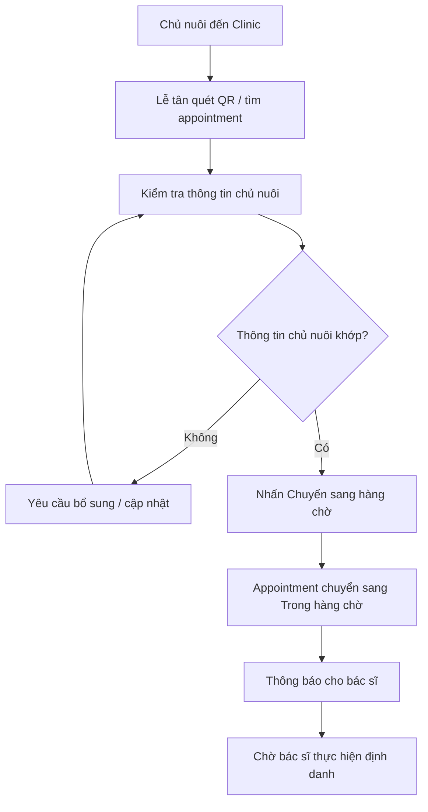
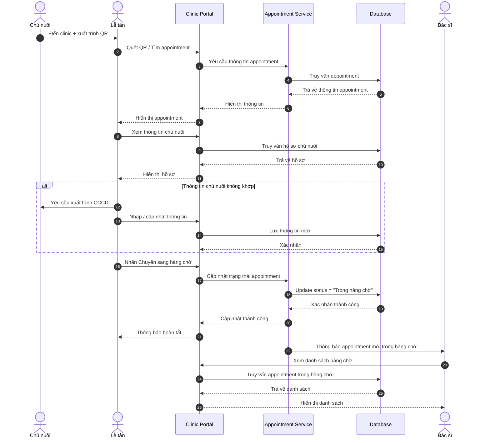
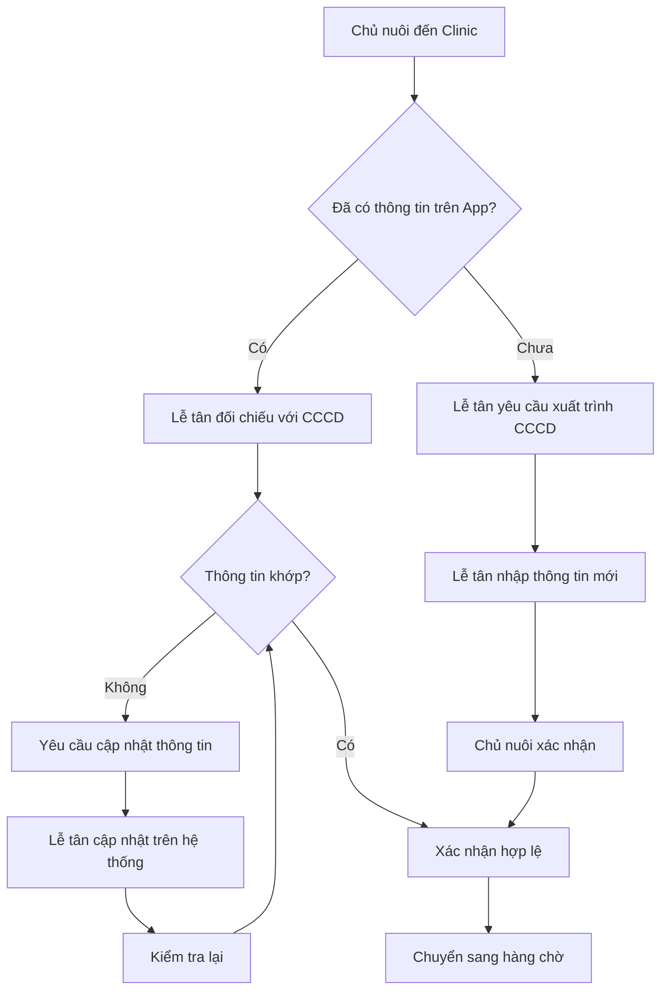

# US-CLI-04: Lễ tân - Kiểm tra hồ sơ chủ nuôi

**Mô tả:** Là một Lễ tân (Receptionist), tôi muốn kiểm tra thông tin chủ nuôi khi họ đến clinic, sau đó chuyển appointment sang trạng thái "Trong hàng chờ" để bác sĩ có thể thực hiện quy trình định danh.

### Điều kiện tiên quyết (Pre-conditions)

- Chủ nuôi đã tạo cuộc hẹn định danh (US-OWN-05) và chọn clinic này làm nơi thực hiện.
- Chủ nuôi đã mang thú cưng cần định danh đến clinic.

> **Lưu ý:** Chủ nuôi có thể đã cung cấp thông tin định danh cá nhân (US-OWN-06) trên App trước, nhưng đây là bước **TÙY CHỌN**. Nếu chưa có, lễ tân sẽ hỗ trợ nhập thông tin trực tiếp tại clinic.

---

### Tiêu chí chấp nhận (Acceptance Criteria - AC)

#### Xem danh sách appointment chờ

- **Danh sách appointment:** Hiển thị danh sách các appointment đã đặt và đang chờ xử lý.
- **Thông tin hiển thị:** Mỗi appointment bao gồm:
    - Mã appointment
    - Tên chủ nuôi
    - Số điện thoại
    - Clinic đã chọn
    - Thời gian tạo hẹn
    - Thời gian còn hiệu lực
    - Trạng thái (`Chờ đến`, `Trong hàng chờ`, `Đã hoàn thành`, `Đã huỷ`, `Hết hạn`)

#### Kiểm tra hồ sơ chủ nuôi

- **Xem thông tin chủ nuôi:** Khi chọn một appointment, hệ thống hiển thị thông tin chủ nuôi đã khai báo:
    - Họ tên (theo CCCD)
    - Số CCCD
    - Số điện thoại
    - Ảnh CCCD (mặt trước, mặt sau)
- **Đối chiếu thực tế:** Lễ tân yêu cầu chủ nuôi xuất trình CCCD để đối chiếu với thông tin đã khai báo.

#### Xử lý hồ sơ chủ nuôi

- **Hồ sơ hợp lệ:** Nếu thông tin chủ nuôi khớp với thực tế, lễ tân nhấn nút **"Chuyển sang hàng chờ"**.
- **Hồ sơ chưa hợp lệ:** Nếu thông tin chưa đầy đủ hoặc không khớp, lễ tân có thể:
    - Yêu cầu chủ nuôi bổ sung thông tin
    - Hỗ trợ chủ nuôi cập nhật thông tin trực tiếp trên hệ thống
    - Sau khi bổ sung xong, tiếp tục kiểm tra và chuyển sang hàng chờ

> **Lưu ý:** Lễ tân **KHÔNG** tạo hồ sơ thú cưng. Việc tạo hồ sơ thú cưng sẽ do **bác sĩ** thực hiện sau khi appointment đã ở trạng thái "Trong hàng chờ".

#### Cập nhật trạng thái appointment

- **Chuyển trạng thái:** Khi nhấn "Chuyển sang hàng chờ", appointment chuyển từ trạng thái "Chờ đến" sang **"Trong hàng chờ"**.
- **Thông báo:** Hệ thống gửi thông báo đến bác sĩ về appointment mới trong hàng chờ.
- **Hiển thị cho bác sĩ:** Appointment xuất hiện trong danh sách "Trong hàng chờ" của bác sĩ để chờ thực hiện định danh.

> **Lưu ý:** Việc hủy appointment chỉ do **chủ nuôi** thực hiện trên App. Lễ tân không có quyền hủy appointment.

### Sơ đồ luồng kiểm tra hồ sơ (Flowchart)

---

### Quy trình vận hành (Workflow)

1. **Chủ nuôi đến clinic:** Lễ tân đón tiếp và quét mã QR hoặc tìm appointment.
2. **Kiểm tra hồ sơ chủ nuôi:** Đối chiếu thông tin chủ nuôi (CCCD) với thực tế.
3. **Xử lý bất cập:** Nếu có sai lệch, yêu cầu chủ nuôi bổ sung/cập nhật thông tin.
4. **Chuyển hàng chờ:** Khi hồ sơ chủ nuôi hợp lệ, chuyển appointment sang trạng thái "Trong hàng chờ".
5. **Thông báo:** Bác sĩ nhận được thông báo và sẽ thực hiện định danh (bao gồm tạo hồ sơ thú cưng nếu cần).

---

### Sơ đồ trình tự (Sequence Diagram)

---

### Quy tắc nghiệp vụ (Business Rules)

- **Chỉ lễ tân mới có quyền kiểm tra và chuyển appointment sang "Trong hàng chờ".**
- **Xác minh danh tính chủ nuôi:** Lễ tân yêu cầu chủ nuôi xuất trình CCCD để xác minh danh tính tại clinic.
- **Cập nhật profile chủ nuôi:**
    - Nếu chủ nuôi đã cung cấp thông tin trên App trước: Lễ tân đối chiếu với CCCD thực tế
    - Nếu chủ nuôi CHƯA cung cấp thông tin trên App: Lễ tân nhập thông tin mới trực tiếp từ CCCD
    - Lễ tân có thể cập nhật thông tin nếu có sai lệch sau khi đã xác minh CCCD
- **Lễ tân KHÔNG tạo hồ sơ thú cưng:** Việc tạo hồ sơ thú cưng sẽ do **bác sĩ** thực hiện sau khi appointment đã ở trạng thái "Trong hàng chờ".
- Appointment chỉ được chuyển sang "Trong hàng chờ" khi:
    - Thông tin chủ nuôi đã được xác thực (đã có trên App hoặc lễ tân nhập mới tại clinic)
- Chủ nuôi không thể tự chuyển appointment sang "Trong hàng chờ" - chỉ lễ tân mới có quyền này.
- Khi appointment ở trạng thái "Trong hàng chờ", bác sĩ sẽ thực hiện định danh thú cưng (US-CLI-05).
- Khi bác sĩ ấn "Định danh" trên một appointment, hệ thống sẽ khóa appointment đó và ngăn các bác sĩ khác không thể thực hiện định danh trùng lặp trên cùng appointment này.
- **Một chủ nuôi chỉ có tối đa 01 appointment hoạt động tại một thời điểm:**
    - Chủ nuôi không thể tạo appointment mới khi đang có appointment ở các trạng thái: `Chờ đến`, `Đã đến clinic`, `Trong hàng chờ`, hoặc `Đang thực hiện`
    - Chỉ được tạo appointment mới khi appointment hiện tại đã ở trạng thái: `Đã hoàn tất`, `Đã hủy`, hoặc `Hết hạn` (qua 4 ngày)
    - Hệ thống tự động kiểm tra và chặn nếu chủ nuôi cố gắng tạo appointment mới khi chưa hoàn tất appointment cũ

---

### Quy trình xử lý cập nhật profile

