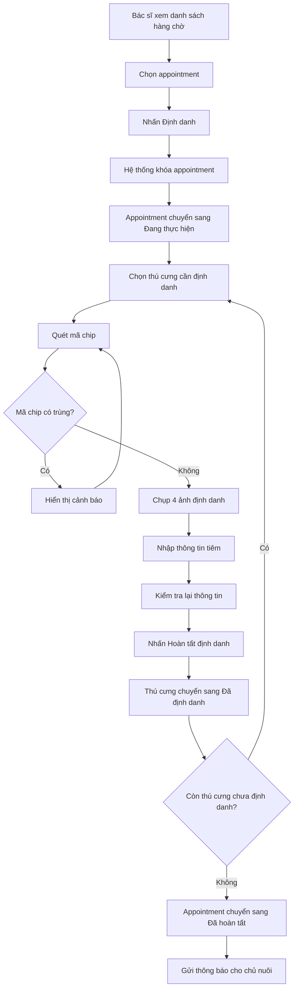
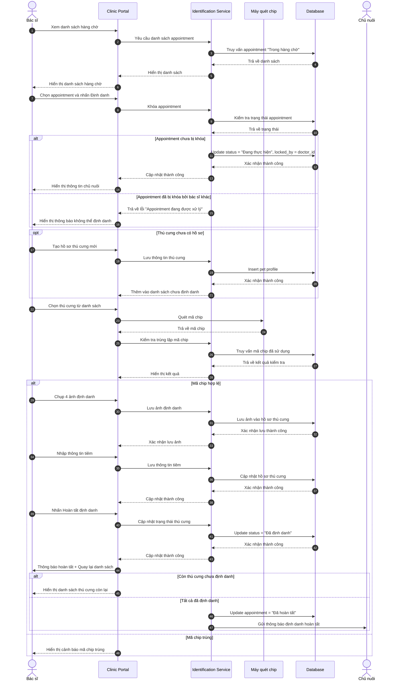

# US-CLI-05: Bác sĩ - Thực hiện cấy chip và hoàn thiện hồ sơ định danh

**Mô tả:** Là một Bác sĩ (Doctor), tôi muốn thực hiện quy trình định danh thú cưng bao gồm: tạo hồ sơ thú cưng (nếu chưa có), cấy chip, nhập mã chip, chụp ảnh định danh và hoàn thiện hồ sơ cho các thú cưng sau khi appointment đã được chuyển sang trạng thái "Trong hàng chờ".

### Điều kiện tiên quyết (Pre-conditions)

- Lễ tân đã kiểm tra hồ sơ chủ nuôi và chuyển appointment sang trạng thái "Trong hàng chờ" (US-CLI-04).
- Lễ tân đã xác minh danh tính chủ nuôi.
- Thiết bị cấy chip và máy quét chip đã sẵn sàng.

> **Lưu ý:** Lễ tân KHÔNG tạo hồ sơ thú cưng. Việc tạo hồ sơ thú cưng sẽ do **bác sĩ** thực hiện sau khi appointment đã ở trạng thái "Trong hàng chờ".

---

### Tiêu chí chấp nhận (Acceptance Criteria - AC)

#### Xem danh sách hàng chờ

- **Danh sách hàng chờ:** Hiển thị danh sách các appointment đang ở trạng thái "Trong hàng chờ".
- **Thông tin hiển thị:** Mỗi appointment bao gồm:
    - Mã appointment
    - Tên chủ nuôi
    - Số điện thoại
    - Số lượng thú cưng đã định danh / Tổng số thú cưng
    - Thời gian chờ
    - Nút **"Định danh"**

#### Thực hiện định danh

- **Chọn appointment:** Bác sĩ chọn một appointment trong danh sách hàng chờ.
- **Khóa appointment:** Khi nhấn nút **"Định danh"**, hệ thống sẽ:
    - Chuyển appointment sang trạng thái "Đang thực hiện"
    - **Khóa appointment** và ngăn các bác sĩ khác không thể thực hiện định danh trên appointment này
    - Hiển thị thông tin chi tiết về chủ nuôi

#### Tạo hồ sơ thú cưng mới

- **Tạo hồ sơ thú cưng:** Bác sĩ có thể tạo nhanh hồ sơ thú cưng ngay tại phòng khám:
    - Tên thú cưng (có thể để tạm)
    - Loài (Species): Chó, Mèo, v.v.
    - Giống (Breed): Có thể chọn hoặc để "Không rõ"
    - Ảnh đại diện (tùy chọn, có thể chụp sau)
    - Ghi chú (nếu có)
- **Thêm nhiều thú cưng:** Bác sĩ có thể tạo nhiều hồ sơ thú cưng cho cùng một chủ nuôi trong cùng appointment.
- **Trạng thái ban đầu:** Thú cưng mới tạo sẽ có trạng thái **"Chưa định danh"** và được thêm vào danh sách chờ định danh.

#### Danh sách thú cưng cần định danh

- **Hiển thị danh sách:** Hệ thống hiển thị danh sách thú cưng trong appointment:
    - Tên thú cưng
    - Loài (Species)
    - Giống (Breed)
    - Trạng thái: `Chưa định danh` / `Đã định danh`
- **Chọn thú cưng:** Bác sĩ chọn một thú cưng từ danh sách "Chưa định danh" để thực hiện.
- **Lọc theo trạng thái:** Chỉ hiển thị thú cưng chưa định danh theo mặc định, có thể xem tất cả.

#### Thực hiện cấy chip

- **Quét mã chip:** Sử dụng máy quét để đọc mã số chip (Chip ID) hoặc nhập tay.
- **Kiểm tra trùng lặp:** Hệ thống tự động kiểm tra mã chip có bị trùng với các chip đã sử dụng hay không.
    - Nếu trùng: Hiển thị cảnh báo "Mã chip đã tồn tại trên hệ thống".
    - Nếu không trùng: Tiếp tục quy trình.

#### Chụp ảnh định danh

- **Yêu cầu 4 ảnh bắt buộc:**
    1. **Ảnh trực diện (Face):** Chụp mặt thú cưng
    2. **Ảnh góc trái (Left side):** Chụp bên trái thú cưng
    3. **Ảnh góc phải (Right side):** Chụp bên phải thú cưng
    4. **Ảnh đặc điểm nhận dạng (Special marks):** Chụp các đặc điểm đặc biệt (nốt ruồi, sẹo, v.v.)
- **Xác nhận ảnh:** Hệ thống yêu cầu xác nhận chất lượng ảnh trước khi lưu.

#### Nhập thông tin tiêm

- **Ngày tiêm:** Tự động điền ngày hiện tại hoặc cho phép chỉnh sửa.
- **Giờ tiêm:** Tự động điền giờ hiện tại hoặc cho phép chỉnh sửa.
- **Nhân sự thực hiện:** Tự động điền tên bác sĩ thực hiện.

#### Hoàn thiện hồ sơ định danh

- **Xác nhận thông tin:** Bác sĩ kiểm tra lại toàn bộ thông tin:
    - Mã chip
    - Ảnh định danh
    - Thông tin tiêm
    - Nhân sự thực hiện
- **Hoàn tất định danh:** Nhấn nút **"Hoàn tất định danh thú cưng này"**.
- **Cập nhật trạng thái:** Thú cưng chuyển từ trạng thái "Chưa định danh" sang **"Đã định danh"**.

#### Xử lý nhiều thú cưng

- **Từng thú cưng:** Mỗi thú cưng được xử lý riêng biệt, có thể hoàn tất từng con một.
- **Quay lại danh sách:** Sau khi hoàn tất một thú cưng, bác sĩ quay lại danh sách để chọn thú tiếp theo.
- **Hoàn tất toàn bộ:** Khi tất cả thú cưng trong appointment đã được định danh, appointment chuyển sang trạng thái "Đã hoàn tất".
- **Thông báo cho chủ nuôi:** Hệ thống tự động gửi thông báo đến chủ nuôi về việc định danh đã hoàn tất.

### Sơ đồ luồng thực hiện định danh (Flowchart)

---

### Quy trình vận hành (Workflow)

1. **Xem hàng chờ:** Bác sĩ kiểm tra danh sách appointment đang chờ trong hàng chờ.
2. **Định danh:** Chọn appointment và nhấn nút "Định danh" (hệ thống tự động khóa appointment).
3. **Tạo hồ sơ thú cưng (nếu chưa có):** Bác sĩ tạo nhanh hồ sơ thú cưng tại phòng khám.
4. **Xem danh sách thú cưng:** Hệ thống hiển thị danh sách thú cưng cần định danh (trạng thái: Chưa định danh).
5. **Chọn thú cưng:** Chọn một thú cưng từ danh sách để thực hiện.
6. **Thực hiện cấy chip:** Cấy chip cho thú cưng và quét mã chip.
7. **Chụp ảnh định danh:** Chụp 4 ảnh theo yêu cầu (trực diện, góc trái, góc phải, đặc điểm).
8. **Nhập thông tin:** Nhập ngày giờ tiêm và xác nhận nhân sự thực hiện.
9. **Hoàn tất một thú cưng:** Kiểm tra lại thông tin và nhấn "Hoàn tất định danh thú cưng này".
10. **Quay lại danh sách:** Sau khi hoàn tất, quay lại danh sách để chọn thú tiếp theo.
11. **Hoàn tất appointment:** Khi tất cả thú cưng đã định danh, appointment chuyển sang "Đã hoàn tất".
12. **Thông báo:** Gửi thông báo đến chủ nuôi về việc định danh đã hoàn tất.

---

### Sơ đồ trình tự (Sequence Diagram)

---

### Quy tắc nghiệp vụ (Business Rules)

- Chỉ bác sĩ mới có quyền thực hiện quy trình định danh (cấy chip, chụp ảnh, hoàn thiện hồ sơ).
- **Bác sĩ có quyền tạo hồ sơ thú cưng mới** tại phòng khám (lễ tân không làm việc này).
- Mỗi thú cưng phải có đủ 4 ảnh định danh mới được hoàn tất.
- Mã chip phải là duy nhất trên toàn hệ thống.
- Bác sĩ có thể hoàn tất định danh từng thú cưng một, không cần phải hoàn tất toàn bộ appointment cùng lúc.
- Khi thú cưng đã được định danh, không thể thay đổi mã chip hoặc ảnh định danh.
- Hệ thống tự động lưu trữ lịch sử định danh bao gồm: bác sĩ thực hiện, thời gian, và các ảnh định danh.
- **Khóa appointment chống trùng lặp:** Khi bác sĩ nhấn nút "Định danh" trên một appointment, hệ thống sẽ:
    - Khóa appointment đó lại và gán cho bác sĩ đang xử lý
    - Ngăn các bác sĩ khác không thể thực hiện định danh trên cùng appointment này
    - Hiển thị thông báo "Appointment đang được xử lý bởi bác sĩ [tên]" khi bác sĩ khác cố gắng truy cập
    - Chỉ mở khóa lại khi appointment hoàn tất hoặc bị hủy
- **Danh sách thú cưng:**
    - Bác sĩ chỉ nhìn thấy và làm việc với thú cưng có trạng thái "Chưa định danh"
    - Sau khi hoàn tất một thú cưng, hệ thống tự động quay lại danh sách để chọn thú tiếp theo
    - Khi tất cả thú cưng đã định danh, appointment tự động chuyển sang "Đã hoàn tất"
