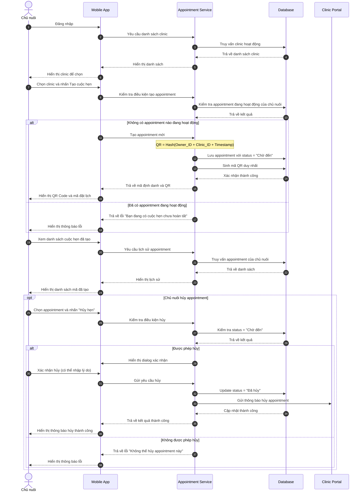

# US-OWN-05: Tạo cuộc hẹn định danh thú cưng

**Mô tả:** Là một chủ nuôi (Pet Owner), tôi muốn chọn Clinic và tạo cuộc hẹn định danh (mã QR) để đưa thú cưng đến clinic thực hiện quy trình gắn chip. Mã QR được sinh dựa trên thông tin chủ nuôi + clinic + thời điểm tạo hẹn.

---

## Mục tiêu

- Chủ nuôi tạo cuộc hẹn định danh trước khi đến clinic
- Mã QR duy nhất dựa trên: **Chủ nuôi + Clinic + Thời điểm tạo hẹn**
- Chủ nuôi sẽ mang **tất cả thú cưng cần định danh** đến clinic
- Clinic sẽ hỗ trợ tạo hồ sơ thú cưng mới và thực hiện định danh

---

## Điều kiện tiên quyết (Pre-conditions)

- Chủ nuôi đã đăng ký tài khoản và đăng nhập vào hệ thống
- Chủ nuôi có thú cưng cần định danh (chưa có hồ sơ trên hệ thống hoặc đã có)

---

## Tiêu chí chấp nhận (Acceptance Criteria - AC)

### Chọn Clinic thực hiện định danh

- **Danh sách Clinic:** Hiển thị danh sách các clinic hỗ trợ dịch vụ định danh chip
- **Thông tin hiển thị:** Mỗi clinic bao gồm:
    - Tên clinic
    - Địa chỉ
    - Số điện thoại
    - Khoảng cách từ vị trí hiện tại
    - Trạng thái (Đang hoạt động / Tạm đóng cửa)
- **Tìm kiếm và lọc:** Chủ nuôi có thể tìm kiếm clinic theo tên, địa chỉ, hoặc lọc theo khoảng cách

### Tạo cuộc hẹn định danh

- **Thông tin cuộc hẹn:** Hệ thống tự động sinh mã QR dựa trên:
    - Thông tin chủ nuôi (đã đăng ký)
    - Clinic đã chọn
    - Thời điểm nhấn "Tạo cuộc hẹn"
- **Mã định danh (Appointment ID):**
    - Mã appointment (ID duy nhất)
    - Tên chủ nuôi
    - Clinic đã chọn
    - Thời gian tạo hẹn
    - Trạng thái (`Chờ đến` / `Đã đến clinic` / `Trong hàng chờ` / `Đang thực hiện` / `Đã hoàn tất` / `Đã hủy`)
- **Không cần chọn thú cưng trước:** Chủ nuôi sẽ mang thú cưng đến clinic, lễ tân sẽ hỗ trợ tạo hồ sơ thú và thực hiện định danh

### Chia sẻ mã định danh

- **Hiển thị QR Code:** Chủ nuôi có thể xem và chụp màn hình mã QR để xuất trình tại clinic
- **Mã đặt lịch:** Hiển thị mã số định dạng text để chủ nuôi có thể đọc cho nhân viên clinic
- **Chia sẻ:** Chủ nuôi có thể chia sẻ mã định danh cho người thân đưa thú cưng đi thay

### Quản lý cuộc hẹn

- **Danh sách cuộc hẹn đã tạo:** Hiển thị lịch sử các cuộc hẹn đã tạo
- **Trạng thái theo thời gian thực:**
    - **Chờ đến:** Mới tạo, chưa đến clinic
    - **Đã đến clinic:** Lễ tân đã xác nhận check-in
    - **Trong hàng chờ:** Đã kiểm tra hồ sơ chủ nuôi, chờ bác sĩ thực hiện
    - **Đang thực hiện:** Bác sĩ đang thực hiện định danh
    - **Đã hoàn tất:** Tất cả thú cưng đã được định danh thành công
    - **Đã hủy:** Cuộc hẹn bị hủy

#### Hủy appointment

- **Điều kiện hủy:** Chủ nuôi có thể hủy appointment khi:
    - Appointment đang ở trạng thái **"Chờ đến"** (chưa đến clinic)
    - Appointment còn trong thời hạn hiệu lực (4 ngày)
- **Không thể hủy khi:**
    - Appointment đã chuyển sang trạng thái **"Đã đến clinic"** (lễ tân đã check-in)
    - Appointment đang ở trạng thái **"Trong hàng chờ"**, **"Đang thực hiện"**, hoặc **"Đã hoàn tất"**
- **Xác nhận hủy:** Hệ thống hiển thị dialog xác nhận:
    - Thông tin appointment sẽ hủy
    - Cảnh báo: "Sau khi hủy, bạn cần tạo mã mới nếu muốn định danh lại"
    - Lý do hủy (tùy chọn, có thể bỏ qua)
- **Xử lý sau khi hủy:**
    - Appointment chuyển sang trạng thái **"Đã hủy"**
    - Gửi thông báo đến clinic về việc hủy appointment
    - Hiển thị thông báo thành công cho chủ nuôi
    - Cho phép chủ nuôi tạo cuộc hẹn mới ngay lập tức

---

## Quy trình vận hành (Workflow)

1. **Đăng nhập:** Chủ nuôi đăng nhập vào tài khoản
2. **Chọn Clinic:** Tìm và chọn clinic muốn đến thực hiện định danh
3. **Tạo cuộc hẹn:** Nhấn nút "Tạo cuộc hẹn" → Hệ thống sinh mã QR duy nhất (dựa trên Chủ nuôi + Clinic + Thời điểm)
4. **Lưu mã:** Chủ nuôi chụp màn hình hoặc lưu mã QR để xuất trình tại clinic
5. **Đến clinic:** Mang theo thú cưng cần định danh + xuất trình mã QR tại quầy lễ tân
6. **Tại clinic:** Lễ tân sẽ hỗ trợ tạo hồ sơ thú cưng (nếu chưa có) và thực hiện quy trình định danh

### Quy trình hủy appointment

1. **Xem danh sách:** Chủ nuôi vào "Cuộc hẹn của tôi"
2. **Chọn appointment:** Nhấn vào appointment muốn hủy (chỉ được hủy khi ở trạng thái "Chờ đến")
3. **Nhấn "Hủy hẹn":** Hệ thống hiển thị dialog xác nhận
4. **Xác nhận hủy:** Chủ nuôi nhấn "Xác nhận hủy" (có thể nhập lý do)
5. **Hoàn tất:** Appointment chuyển sang "Đã hủy", nhận thông báo thành công

---

## Sơ đồ trình tự (Sequence Diagram)

---

## Quy tắc nghiệp vụ (Business Rules)

- Mỗi cuộc hẹn chỉ áp dụng cho **một chủ nuôi** tại **một clinic** đã chọn
- **Không cần chọn thú cưng trước:** Chủ nuôi sẽ mang tất cả thú cưng cần định danh đến clinic
- **Tại clinic:** Lễ tân sẽ hỗ trợ tạo hồ sơ thú cưng mới (nếu chưa có) và thực hiện định danh
- Mã định danh có giá trị sử dụng trong **4 ngày** kể từ ngày tạo
- Chủ nuôi có thể tạo nhiều cuộc hẹn cho nhiều lần đến clinic khác nhau
- Mã định danh chỉ được sử dụng tại **clinic đã chọn** khi tạo
- Khi đến clinic, chủ nuôi cần xuất trình mã QR hoặc mã số cho lễ tân để quét/xác nhận
- Sau khi lễ tân xác nhận check-in, trạng thái sẽ chuyển từ "Chờ đến" sang "Đã đến clinic"
- **Hủy appointment:**
    - Chủ nuôi có quyền hủy appointment khi đang ở trạng thái "Chờ đến"
    - **Không được hủy** khi appointment đã chuyển sang "Đã đến clinic", "Trong hàng chờ", "Đang thực hiện", hoặc "Đã hoàn tất"
    - Sau khi hủy, chủ nuôi có thể tạo cuộc hẹn mới ngay lập tức
    - Hệ thống gửi thông báo đến clinic về việc hủy appointment
- **Giới hạn appointment:**
    - **Một chủ nuôi chỉ có tối đa 01 appointment hoạt động tại một thời điểm**
    - Không thể tạo appointment mới khi đang có appointment ở trạng thái: `Chờ đến`, `Đã đến clinic`, `Trong hàng chờ`, hoặc `Đang thực hiện`
    - Chỉ được tạo appointment mới khi appointment hiện tại đã ở trạng thái: `Đã hoàn tất`, `Đã hủy`, hoặc `Hết hạn` (qua 4 ngày)
    - Hệ thống hiển thị thông báo lỗi: "Bạn đang có cuộc hẹn định danh chưa hoàn tất. Vui lòng hoàn tất hoặc hủy cuộc hẹn hiện tại trước khi tạo mới."

---

## Giao diện đề xuất

### Màn hình chọn Clinic

- Bản đồ hiển thị vị trí các clinic
- Danh sách clinic với thông tin chi tiết
- Bộ lọc theo khoảng cách, đánh giá, trạng thái

### Màn hình tạo cuộc hẹn

- Thông tin chủ nuôi (đã đăng nhập)
- Clinic đã chọn
- Nút "Tạo cuộc hẹn"

### Màn hình hiển thị QR Code

- QR Code lớn, rõ ràng
- Mã số định dạng text
- Thông tin tóm tắt (tên chủ nuôi, clinic, thời gian tạo)
- Nút chia sẻ / chụp màn hình

### Màn hình danh sách cuộc hẹn

- Card hiển thị từng cuộc hẹn với trạng thái màu sắc
- Thông tin: Ngày tạo, Clinic, Trạng thái
- Nhấn vào card để xem chi tiết
- **Nút "Hủy hẹn":** Hiển thị với appointment ở trạng thái "Chờ đến"
    - Màu đỏ/cảnh báo
    - Vô hiệu hóa (disabled) với các trạng thái khác

### Màn hình chi tiết appointment

- Thông tin đầy đủ của appointment
- QR Code lớn (nếu ở trạng thái "Chờ đến")
- **Nút "Hủy hẹn"** ở góc dưới (nếu được phép hủy)
- Khi nhấn "Hủy hẹn":
    - Dialog hiển thị thông tin appointment
    - Cảnh báo: "Sau khi hủy, bạn cần tạo mã mới nếu muốn định danh lại"
    - Trường nhập lý do hủy (optional)
    - Nút "Xác nhận hủy" và "Hủy"
