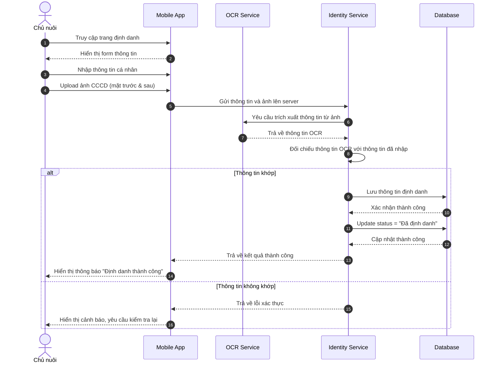
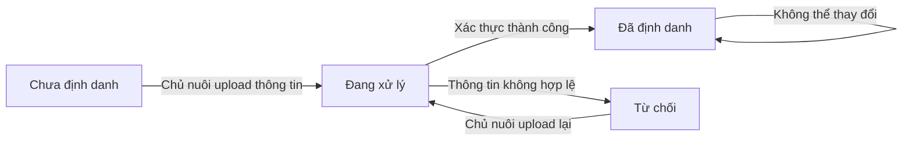

# US-OWN-06: Định danh bản thân (chủ nuôi) - TÙY CHỌN

**Mô tả:** Là một chủ nuôi (Pet Owner), tôi muốn cung cấp thông tin định danh cá nhân (Họ tên, CCCD) trên App để tiết kiệm thời gian khi đến clinic. Đây là bước **TÙY CHỌN**, không bắt buộc.

> **Lưu ý quan trọng:** Chủ nuôi **KHÔNG BẮT BUỘC** phải cung cấp thông tin định danh trên App trước. Nếu chưa làm, lễ tân sẽ hỗ trợ xác minh danh tính và nhập thông tin trực tiếp tại clinic (US-CLI-04).

---

## Mục tiêu

- Chủ nuôi cung cấp thông tin định danh cá nhân (CCCD) để xác minh danh tính
- Hoàn thiện hồ sơ pháp lý bắt buộc trước khi thực hiện định danh thú cưng
- Lễ tân có thể đối chiếu thông tin khi chủ nuôi đến clinic

---

## Điều kiện tiên quyết (Pre-conditions)

- Chủ nuôi đã đăng ký tài khoản trong hệ thống
- Chủ nuôi đã tạo mã định danh cho thú cưng (US-OWN-05) hoặc đang trong quá trình thực hiện

---

## Tiêu chí chấp nhận (Acceptance Criteria - AC)

### Cung cấp thông tin định danh

- **Form nhập thông tin:** Chủ nuôi điền các thông tin bắt buộc:
    - Họ và tên (theo CCCD)
    - Số CCCD/CMND
    - Ngày cấp
    - Nơi cấp
    - Số điện thoại liên hệ
    - Email (nếu có)

- **Validation:**
    - Họ tên: Không được để trống, chỉ chấp nhận ký tự chữ cái và khoảng trắng
    - Số CCCD: Bắt buộc 12 chữ số
    - Ngày cấp: Không được là ngày trong tương lai
    - Số điện thoại: Không được để trống, định dạng Việt Nam

### Upload ảnh CCCD

- **Yêu cầu 2 ảnh bắt buộc:**
    1. **Mặt trước CCCD:** Chụp rõ mặt trước, không mờ, không che khuất
    2. **Mặt sau CCCD:** Chụp rõ mặt sau, không mờ, không che khuất

- **Kiểm tra chất lượng ảnh:**
    - Độ phân giải tối thiểu: 1MB
    - Định dạng hỗ trợ: JPG, PNG, HEIC
    - Cảnh báo nếu ảnh mờ hoặc không đạt chất lượng

- **Xử lý ảnh:**
    - Tự động crop và căn chỉnh ảnh
    - Tăng cường độ sáng nếu cần thiết

### Xác thực thông tin

- **OCR tự động:** Hệ thống sử dụng OCR để trích xuất thông tin từ ảnh CCCD
- **Đối chiếu thông tin:** So sánh thông tin OCR với thông tin chủ nuôi đã nhập
    - Nếu khớp: Tự động điền và xác nhận
    - Nếu không khớp: Cảnh báo và yêu cầu xác nhận lại

- **Kết quả xác thực:**
    - **Thành công:** Thông tin đã được xác thực, hiển thị trạng thái "Đã định danh"
    - **Thất bại:** Yêu cầu chủ nuôi kiểm tra và upload lại ảnh

### Quản lý trạng thái định danh

- **Chưa định danh:** Chưa cung cấp thông tin CCCD
- **Đang xử lý:** Đã upload thông tin, hệ thống đang xác thực
- **Đã định danh:** Thông tin đã được xác thực thành công
- **Từ chối:** Thông tin không hợp lệ, yêu cầu cung cấp lại

### Xem và cập nhật thông tin

- **Xem thông tin:** Chủ nuôi có thể xem lại thông tin định danh đã cung cấp
- **Cập nhật:** Chỉ được phép cập nhật khi:
    - Chưa đến clinic thực hiện định danh
    - Hoặc được lễ tân hỗ trợ cập nhật tại clinic (US-CLI-04)

---

## Quy trình vận hành (Workflow)

1. **Truy cập trang định danh:** Chủ nuôi vào phần "Định danh cá nhân" trong app
2. **Nhập thông tin:** Điền đầy đủ thông tin theo form yêu cầu
3. **Upload CCCD:** Chụp hoặc upload ảnh mặt trước và mặt sau CCCD
4. **Xác thực:** Hệ thống tự động xác thực thông tin qua OCR
5. **Hoàn tất:** Nếu thành công, trạng thái chuyển sang "Đã định danh"
6. **Thông báo:** Chủ nuôi nhận được thông báo xác thực thành công

---

## Sơ đồ trình tự (Sequence Diagram)

---

## Sơ đồ trạng thái định danh

---

## Quy tắc nghiệp vụ (Business Rules)

- **TÙY CHỌN, KHÔNG BẮT BUỘC:** Chủ nuôi có thể cung cấp thông tin định danh trên App trước để tiết kiệm thời gian, nhưng không bắt buộc. Nếu chưa làm, lễ tân sẽ hỗ trợ tại clinic.
- **Thông tin chính xác:** Thông tin cung cấp phải trùng khớp với giấy tờ tùy thân (CCCD/CMND)
- **Không tự cập nhật sau khi đã đến clinic:** Sau khi chủ nuôi đã đến clinic và lễ tân đã kiểm tra hồ sơ (US-CLI-04), chủ nuôi không thể tự cập nhật thông tin định danh trên app
- **Lễ tân hỗ trợ cập nhật:** Nếu thông tin cần chỉnh sửa sau khi đến clinic, chỉ lễ tân mới có quyền hỗ trợ cập nhật
- **Bảo mật thông tin:** Ảnh CCCD và thông tin cá nhân được mã hóa và lưu trữ an toàn theo quy định bảo vệ dữ liệu
- **Một CCCD duy nhất:** Một số CCCD chỉ được sử dụng cho **một tài khoản chủ nuôi** trên hệ thống
- **Lợi ích khi cung cấp thông tin trước:**
    - Tiết kiệm thời gian chờ đợi tại clinic
    - Chủ động kiểm tra và nhập thông tin chính xác
    - Khi đến clinic chỉ cần đối chiếu nhanh, không cần nhập lại từ đầu
