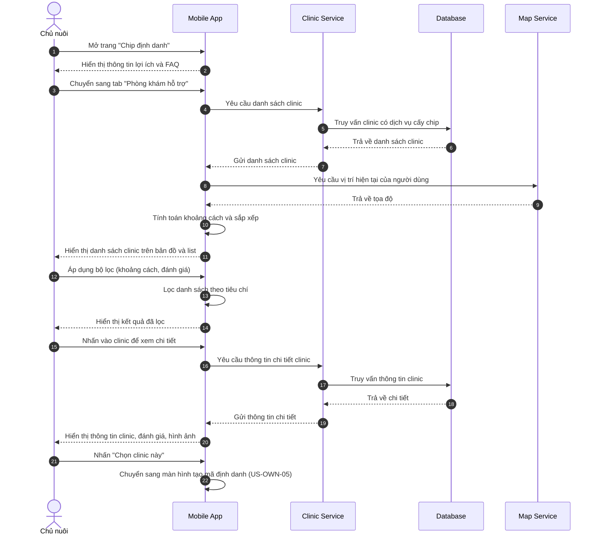

# US-OWN-07: Tìm hiểu về Chip định danh & Các phòng khám hỗ trợ

**Mô tả:** Là một chủ nuôi (Pet Owner), tôi muốn xem thông tin về lợi ích của chip định danh và tìm kiếm danh sách phòng khám hỗ trợ dịch vụ để chuẩn bị cho việc định danh thú cưng.

---

## Mục tiêu

- Cung cấp thông tin đầy đủ về lợi ích của chip định danh thú cưng
- Giúp chủ nuôi tìm kiếm clinic phù hợp gần nơi ở/làm việc
- Tạo sự tin tưởng và hiểu biết về quy trình định danh

---

## Điều kiện tiên quyết (Pre-conditions)

- Chủ nuôi đã đăng ký tài khoản và đăng nhập vào hệ thống
- Không yêu cầu điều kiện đặc biệt khác

---

## Tiêu chí chấp nhận (Acceptance Criteria - AC)

### Giới thiệu về Chip định danh

- **Lợi ích của chip định danh:** Hiển thị thông tin chi tiết:
    1. **Nhận diện thú cưng vĩnh viễn:** Chip có tuổi thọ lên đến 25 năm, không cần thay thế
    2. **Chống thất lạc:** Khi thú cưng đi lạc, bất kỳ clinic nào có máy quét đều có thể nhận diện
    3. **Xác minh quyền sở hữu:** Kết nối thú cưng với chủ nuôi hợp pháp trên hệ thống
    4. **Hỗ trợ y tế:** Lưu trữ lịch sử tiêm chủng, bệnh án, dị ứng của thú cưng
    5. **Tuân thủ pháp luật:** Đáp ứng quy định của nhà nước về quản lý thú cưng

- **FAQ - Câu hỏi thường gặp:**
    - Chip định danh là gì?
    - Quy trình cấy chip có đau không?
    - Chip có ảnh hưởng đến sức khỏe thú cưng không?
    - Chi phí cấy chip là bao nhiêu?
    - Làm sao để kiểm tra thông tin chip?

- **Video/Infographic:** Minh họa quy trình cấy chip và lợi ích

### Tìm kiếm phòng khám hỗ trợ

- **Bản đồ tương tác:** Hiển thị vị trí các clinic trên bản đồ
- **Danh sách clinic:** Sắp xếp theo khoảng cách từ vị trí hiện tại
- **Thông tin mỗi clinic:**
    - Tên clinic
    - Địa chỉ chi tiết
    - Số điện thoại liên hệ
    - Giờ làm việc
    - Khoảng cách (km)
    - Đánh giá trung bình (sao)
    - Trạng thái (Đang mở / Đóng cửa)
    - Dịch vụ hỗ trợ (Cấy chip, Tái khám, Phẫu thuật, v.v.)

- **Bộ lọc tìm kiếm:**
    - Khoảng cách (1km, 3km, 5km, 10km, Tất cả)
    - Đánh giá (3 sao trở lên, 4 sao trở lên, 5 sao)
    - Dịch vụ (Chỉ hiện clinic có cấy chip)
    - Trạng thái (Chỉ hiện clinic đang mở)

- **Chi tiết clinic:** Khi nhấn vào clinic, hiển thị:
    - Thông tin liên hệ đầy đủ
    - Hình ảnh clinic
    - Đánh giá và nhận xét từ khách hàng trước
    - Nút "Chỉ đường" (mở Google Maps / Apple Maps)
    - Nút "Gọi điện"
    - Nút "Chọn clinic này" (tạo mã định danh - US-OWN-05)

---

## Quy trình vận hành (Workflow)

1. **Truy cập trang thông tin:** Chủ nuôi vào phần "Chip định danh" trong app
2. **Xem lợi ích:** Đọc thông tin về lợi ích của chip định danh
3. **Xem FAQ:** Tìm hiểu các câu hỏi thường gặp
4. **Tìm kiếm clinic:** Vào tab "Phòng khám hỗ trợ"
5. **Lọc và chọn:** Sử dụng bộ lọc để tìm clinic phù hợp
6. **Xem chi tiết:** Nhấn vào clinic để xem thông tin chi tiết
7. **Chọn clinic:** Nhấn "Chọn clinic này" để tiến tới tạo mã định danh (US-OWN-05)

---

## Sơ đồ trình tự (Sequence Diagram)

---

## Quy tắc nghiệp vụ (Business Rules)

- **Hiển thị đầy đủ thông tin:** Tất cả clinic đăng ký dịch vụ cấy chip phải hiển thị công khai trên hệ thống
- **Cập nhật trạng thái real-time:** Trạng thái "Đang mở / Đóng cửa" của clinic được cập nhật theo giờ làm việc đã đăng ký
- **Khoảng cách chính xác:** Khoảng cách được tính từ vị trí hiện tại của người dùng đến clinic, làm tròn đến 1 chữ số thập phân
- **Đánh giá khách quan:** Điểm đánh giá của clinic dựa trên trung bình cộng đánh giá từ người dùng đã sử dụng dịch vụ
- **Không ưu tiên trả phí:** Clinic không thể trả phí để được hiển thị cao hơn, thứ tự sắp xếp chỉ dựa trên khoảng cách và đánh giá
- **Thông tin liên hệ xác thực:** Clinic phải xác thực thông tin liên hệ trước khi được hiển thị trên hệ thống

---

## Giao diện đề xuất

### Màn hình giới thiệu Chip định danh
- Header: "Chip định danh thú cưng là gì?"
- Carousel hoặc scrolling cards hiển thị 5 lợi ích chính
- Video minh họa quy trình cấy chip (nếu có)
- Section FAQ với accordion mở rộng
- Nút CTA: "Tìm phòng khám gần tôi"

### Màn hình danh sách Phòng khám
- Tab bar: "Giới thiệu" | "Phòng khám"
- Bản đồ tương tác chiếm nửa trên màn hình
- Danh sách card clinic ở nửa dưới (có thể scroll)
- Mỗi card: Tên clinic, khoảng cách, đánh giá, trạng thái
- Nút filter ở góc trên phải
- Floating Action Button: "Chọn trên bản đồ"

### Màn hình chi tiết Phòng khám
- Header: Hình ảnh clinic
- Thông tin: Tên, địa chỉ, SĐT, giờ làm việc
- Nút hành động: "Chỉ đường", "Gọi điện", "Chọn clinic này"
- Section: Dịch vụ cung cấp
- Section: Đánh giá và nhận xét từ khách hàng
- Section: Các clinic gần đây (gợi ý thêm)
