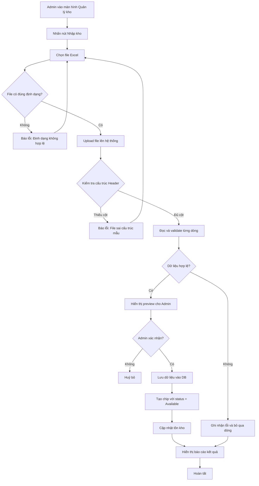
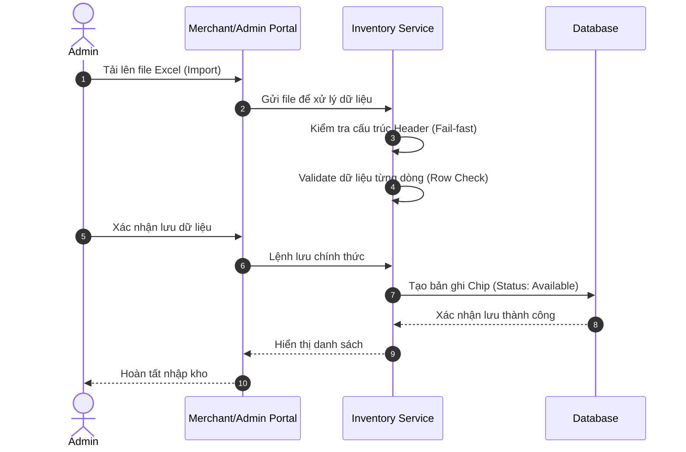

# US-ADM-06: Nhập kho Chip định danh từ Nhà cung cấp

**Mô tả:** Là một Quản trị viên (Admin), tôi muốn thực hiện nhập hàng loạt Chip định danh vào hệ thống thông qua file Excel để khởi tạo tồn kho khả dụng, sẵn sàng phục vụ quy trình ký gửi cho các phòng khám (Clinics).

### Điều kiện tiên quyết (Pre-conditions)

- Người dùng đã đăng nhập với quyền **Central Admin**.
- Hệ thống đã sẵn sàng cấu hình mẫu file Import (Template) với các trường: `Model`, `ID`, `SN No.`, `Expiry Date`.

---

### Tiêu chí chấp nhận (Acceptance Criteria - AC)

#### Giao diện Trung tâm quản lý kho (Inventory Dashboard)

- **Cấu trúc màn hình:** Hiển thị menu "Quản lý Kho Chip" với bố cục hai phần chính:
    - **Khu vực Tác vụ (Action Bar):** Bao gồm
        - Thanh tìm kiếm (Search)
        - Nút [Nhập kho]
        - Nút [Xuất kho ký gửi]
    - **Khu vực Dữ liệu (Data Table):** Hiển thị danh sách các Chip đang lưu tại kho tổng (chưa xuất cho Clinic).
- **Thông tin hiển thị:** Bảng dữ liệu bao gồm các cột:
    - `Mã Lô hàng (Batch)`
    - `Ngày nhập`
    - `Model`
    - `ID Chip`
    - `Số Serial (SN No.)`
    - `Ngày hết hạn`
    - `Trạng thái`
- **Tính năng điều chỉnh:** Cung cấp tác vụ nhanh để thay đổi trạng thái Chip sang: "Lỗi do Tomotek" hoặc "Lỗi do Nhà sản xuất".

#### Tải lên và Xem trước dữ liệu (Upload & Preview)

- **Kiểm soát định dạng:** Hệ thống chỉ chấp nhận định dạng file `.xlsx` hoặc `.xls`. Nếu tải lên định dạng khác, hiển thị thông báo lỗi và ngăn chặn lệnh Submit.
- **Màn hình Xem trước (Preview Modal):** Sau khi tải file lên thành công, hệ thống hiển thị một Dialog/Modal chứa bảng dữ liệu xem trước để Admin kiểm tra lại trước khi chính thức lưu vào Database.
- **Dữ liệu hệ thống tự sinh:** Tại màn hình Preview, hai trường sau sẽ được hệ thống tự động khởi tạo (Read-only):
    - **Ngày nhập:** Mặc định theo thời gian thực thi lệnh.
    - **Lô hàng (Batch Code):** Tự động sinh theo quy tắc hệ thống (Ví dụ: BATCH-YYYYMMDD-XXX).

#### Quy tắc Kiểm soát dữ liệu (Validation Rules)

Hệ thống thực hiện kiểm tra qua hai lớp bảo vệ:

- **Lớp 1 - Kiểm tra cấu trúc (Header Validation):**
    - Hệ thống kiểm tra sự tồn tại của 04 cột bắt buộc: `Model`, `ID`, `SN No.`, `Expiry Date`.
    - **Cơ chế Fail-fast:** Nếu thiếu bất kỳ cột nào, hệ thống dừng quy trình Import ngay lập tức và báo lỗi "File sai cấu trúc mẫu".
- **Lớp 2 - Kiểm tra nội dung (Row Validation):**
    - `SN No.`: Không được để trống và không trùng lặp với dữ liệu đã có trong DB.
    - `Expiry Date`: Phải đúng định dạng ngày tháng và có giá trị trong tương lai.
    - **Cơ chế Partial Success:** Các dòng dữ liệu hợp lệ sẽ được chuẩn bị để lưu; các dòng lỗi sẽ bị từ chối.

#### Khởi tạo thực thể Chip và Trạng thái (Data Creation)

- **Ghi danh Database:** Với mỗi dòng dữ liệu hợp lệ, hệ thống khởi tạo một thực thể Chip mới với đầy đủ các thuộc tính từ file Excel.
- **Quản lý trạng thái:** Tất cả Chip mới nhập sẽ được gắn trạng thái mặc định là **"Available"** (Sẵn sàng phục vụ).
- **Cập nhật tồn kho:** Tổng số lượng tồn khả dụng (Available) tại kho tổng tăng lên tương ứng với số lượng bản ghi nhập thành công.

#### Phản hồi kết quả và Nhật ký hệ thống (Reporting & Audit Log)

- **Thông báo kết quả:** Hiển thị bản tóm tắt kết quả (Toast hoặc Modal Summary) bao gồm:
    - Tổng số dòng xử lý (Total).
    - Số lượng thành công (Success).
    - Số lượng thất bại (Failed) kèm danh sách vị trí dòng lỗi và lý do chi tiết.
- **Lưu vết (Audit Log):** Hệ thống ghi lại nhật ký lịch sử nhập kho bao gồm: Người thực hiện, thời gian, tên file gốc và kết quả tổng hợp để phục vụ đối soát.

### Sơ đồ luồng nhập kho (Flowchart)

---

### Quy trình vận hành (Workflow)

1.  **Truy cập:** Admin điều hướng đến màn hình Quản lý kho.
2.  **Upload:** Chọn file Excel chứa danh sách Chip.
3.  **Validate:** Hệ thống kiểm tra cấu trúc và tính hợp lệ của từng dòng dữ liệu.
4.  **Preview:** Admin xác nhận lại thông tin qua màn hình xem trước.
5.  **Execution:** Hệ thống lưu dữ liệu vào DB và thiết lập trạng thái `Available`.
6.  **Report:** Hệ thống hiển thị báo cáo chi tiết về lượt nhập kho.

---

### Sơ đồ trình tự (Sequence Diagram)

