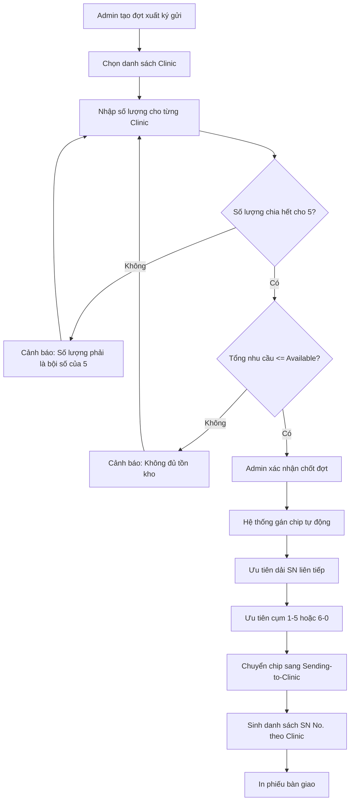
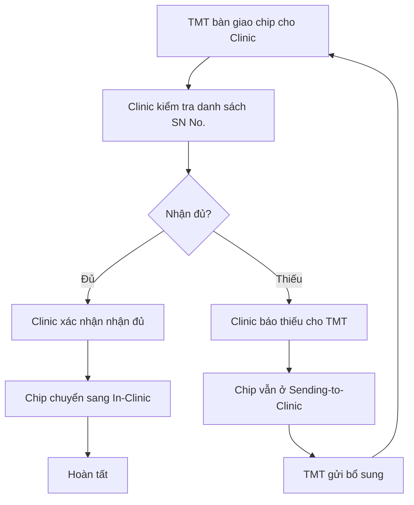
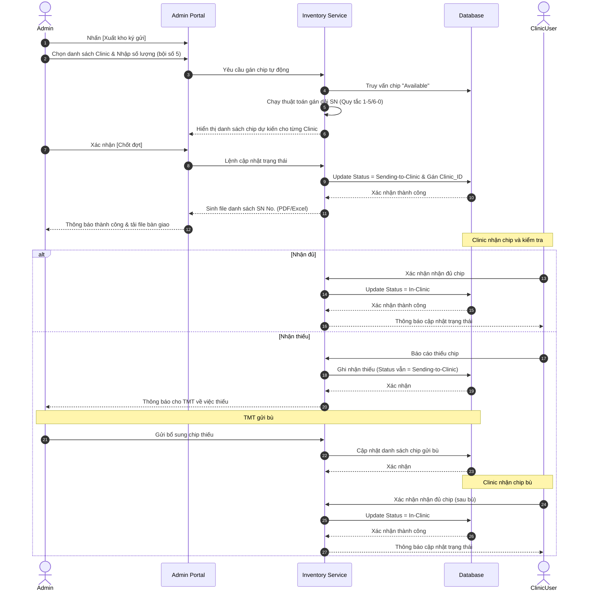

# US-ADM-07: Xuất kho ký gửi Chip cho Clinic

**Mô tả:** Là một Quản trị viên (Admin), tôi muốn tạo các đợt phân bổ chip và gán số lượng cho từng Clinic để chuyển chip từ kho tổng đến phòng khám dưới hình thức ký gửi, đảm bảo khớp quy tắc đóng gói túi 5 kim thực tế.

### Điều kiện tiên quyết (Pre-conditions)

- Người dùng đã đăng nhập với quyền **Central Admin**.
- Các Clinic nhận hàng đã được khởi tạo và ở trạng thái hoạt động trên hệ thống.
- Kho tổng có đủ số lượng chip ở trạng thái **"Available"**.

---

### Tiêu chí chấp nhận (Acceptance Criteria - AC)

#### Khởi tạo đợt phân bổ (Create Export Round)

- **Điểm kích hoạt:** Tại màn hình Quản lý Kho Chip, Admin nhấn nút **[Xuất kho ký gửi]**.
- **Thông tin đợt xuất:** Hệ thống hiển thị form khởi tạo bao gồm:
    - **Tên/Mã đợt xuất:** Tự động sinh (ví dụ: EXP-YYYYMMDD-XXX)
    - **Ngày xuất:** Mặc định là ngày hiện tại.
    - **Danh sách Clinic:** Cho phép chọn một hoặc nhiều Clinic sẽ nhận chip trong đợt này (Multi-select).

#### Phân bổ số lượng theo từng Clinic (Quantity Allocation)

- **Nhập số lượng:** Với mỗi Clinic đã chọn trong danh sách, hệ thống hiển thị ô nhập số lượng chip phân bổ.
- **Ràng buộc bội số của 5:** Hệ thống chỉ chấp nhận giá trị là **bội số của 5** (ví dụ: 5, 10, 50, 100...).
    - Nếu nhập số không chia hết cho 5, hệ thống hiển thị cảnh báo: "Số lượng xuất phải là bội số của 5 (tương ứng với quy cách đóng gói 5 chip/túi)".
- **Kiểm tra tổng tồn:** Hệ thống tính toán tổng nhu cầu của đợt xuất. Nếu **Tổng nhu cầu > Tổng tồn Available**, hệ thống hiển thị cảnh báo và không cho phép chốt đợt.

#### Thuật toán gán dải Chip tự động (Auto-Allocation Logic)

Sau khi Admin xác nhận số lượng, hệ thống thực hiện gán danh sách `SN No.` cụ thể cho từng Clinic dựa trên quy tắc tối ưu đóng gói:

- **Quy tắc cụm túi (Ideal Bag Rule):** Hệ thống ưu tiên chọn các chip có 5 chữ số cuối của `SN No.` thuộc cụm `1-5` (ví dụ: ...01 đến ...05) hoặc `6-0` (ví dụ: ...06 đến ...10). Điều này giúp khớp chính xác với túi 5 kim đóng gói sẵn từ nhà máy.
    - _Ví dụ:_ Nếu Clinic A cần 5 chip, hệ thống sẽ ưu tiên chọn dải `...438901` đến `...438905` thay vì chọn dải `...438903` đến `...438907`.
- **Ưu tiên dải liên tiếp (Continuity Priority):** Hệ thống ưu tiên chọn các dãy `SN No.` liên tục tăng dần để thuận tiện cho việc đối soát trên phiếu bàn giao và kiểm đếm thực tế.
    - _Ví dụ:_ Clinic B cần 10 chip.
        - **Lựa chọn 1 (Ưu tiên):** Dải liên tục `...001` đến `...010` (Gồm 2 túi nguyên: 001-005 và 006-010).
        - **Lựa chọn 2:** Dải `...011` đến `...015` và `...026` đến `...030` (Hệ thống chỉ chọn cách này nếu dải liên tục 10 số đã bị khuyết).
- **Xử lý chip lẻ (Fragment Handling):** Trường hợp tồn kho tổng không còn đủ các dải "đẹp" hoặc "nguyên túi" (do các đợt báo hỏng hoặc xuất lẻ trước đó), hệ thống sẽ tự động quét và ghép các đoạn chip khả dụng khác nhau cho đến khi đủ số lượng yêu cầu.
    - _Ví dụ:_ Clinic C cần 5 chip, nhưng trong kho chỉ còn các chip rời rạc sau khi đã trừ các mã lỗi:
        - Kho còn: `...101, ...102, ...105` (Túi 1 bị khuyết 103, 104) và `...111, ...112` (Túi 2 bị khuyết 113, 114, 115).
        - **Kết quả:** Hệ thống sẽ tự động gán cả 5 mã lẻ này vào đơn xuất để giải phóng hàng tồn lẻ trong kho tổng.

---

#### In ấn và Truy xuất (Printing & Tracking)

- **Xuất danh sách:** Hệ thống hỗ trợ in hoặc xuất file (PDF/Excel) danh sách `SN No.` theo từng Clinic để đính kèm vào biên bản bàn giao vật lý.
- **Lịch sử đợt xuất:** Admin có thể xem lại thông tin chi tiết các đợt xuất cũ, bao gồm danh sách chip đã gán cho từng bên.

#### Bảng minh họa quy tắc gán dải số (SN No. Assignment Table)

Giả sử Admin xuất **15 chip** cho Clinic X:

| Ưu tiên | Cách gán dải `SN No.`                                              | Trạng thái vật lý tương ứng                                            |
| :------ | :----------------------------------------------------------------- | :--------------------------------------------------------------------- |
| **1**   | `...001` $\rightarrow$ `...015`                                    | **3 túi nguyên** (Túi 1: 01-05, Túi 2: 06-10, Túi 3: 11-15)            |
| **2**   | `...006` $\rightarrow$ `...020`                                    | **3 túi nguyên** (Túi 1: 06-10, Túi 2: 11-15, Túi 3: 16-20)            |
| **3**   | `...001` $\rightarrow$ `...010` và `...021` $\rightarrow$ `...025` | **3 túi nguyên nhưng không liên tiếp** (Do dải 11-20 đã xuất trước đó) |
| **4**   | `...001, ...002, ...005, ...021` $\rightarrow$ `...022`            | **Ghép lẻ** (Do kho chỉ còn các mã này khả dụng)                       |

#### Chốt đợt và Cập nhật trạng thái (Commit & Status Update)

- **Nút xác nhận:** Admin nhấn **[Xác nhận và Chốt đợt]**.
- **Cập nhật dữ liệu:**
    - Trạng thái của các chip được gán chuyển từ `Available` sang **`Sending-to-Clinic`**.
    - Ghi nhận thông tin Clinic sở hữu tạm thời cho từng mã chip.
- **Sinh phiếu bàn giao:** Hệ thống tự động tạo các **Phiếu xuất kho ký gửi** tương ứng cho từng Clinic. Mỗi phiếu bao gồm thông tin: Tên Clinic, Mã đợt, Tổng số lượng và Danh sách chi tiết các mã `SN No.`.

### Sơ đồ luồng xuất kho ký gửi (Flowchart)

### Sơ đồ luồng nhận chip tại Clinic

---

### Quy trình vận hành (Workflow)

1.  **Khởi tạo:** Admin nhấn [Xuất kho ký gửi] và chọn các Clinic nhận hàng.
2.  **Phân bổ:** Nhập số lượng (bội số của 5) cho từng Clinic.
3.  **Gán chip:** Hệ thống tự động chạy thuật toán chọn dải `SN No.` phù hợp quy tắc túi 5 kim.
4.  **Xác nhận:** Admin kiểm tra danh sách dự kiến và nhấn chốt đợt.
5.  **Bàn giao:** In phiếu danh sách `SN No.` và thực hiện bàn giao vật lý cho Clinic.
6.  **Nhận chip:** Clinic nhận chip và kiểm tra danh sách:
    - **Nếu nhận đủ:** Clinic xác nhận → trạng thái chuyển sang `In-Clinic`
    - **Nếu nhận thiếu:** Clinic báo thiếu, chip vẫn ở `Sending-to-Clinic` để TMT gửi bù
7.  **Gửi bù (nếu thiếu):** TMT gửi bổ sung chip thiếu → Clinic nhận đủ và xác nhận → trạng thái chuyển sang `In-Clinic`

---

### Sơ đồ trình tự (Sequence Diagram)

