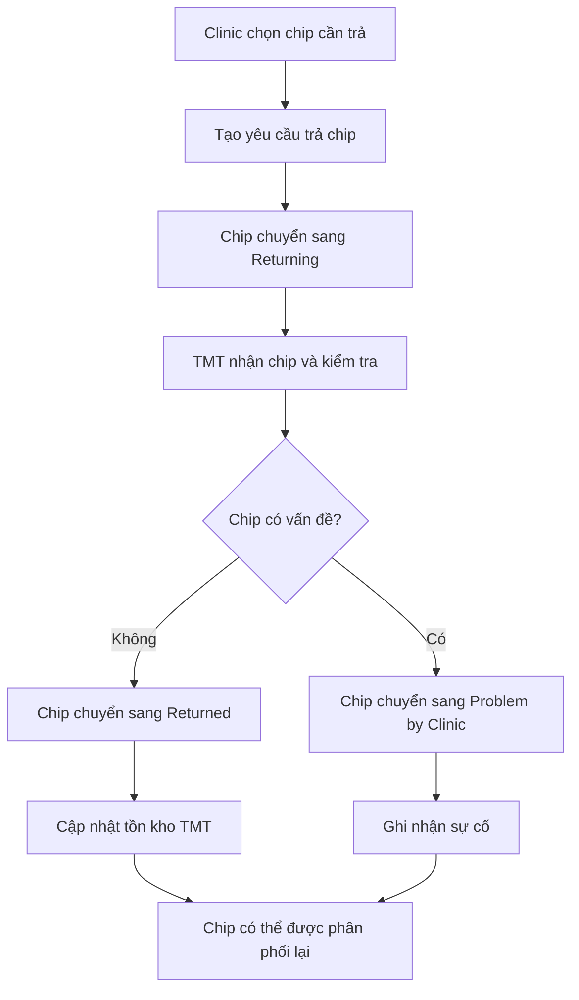
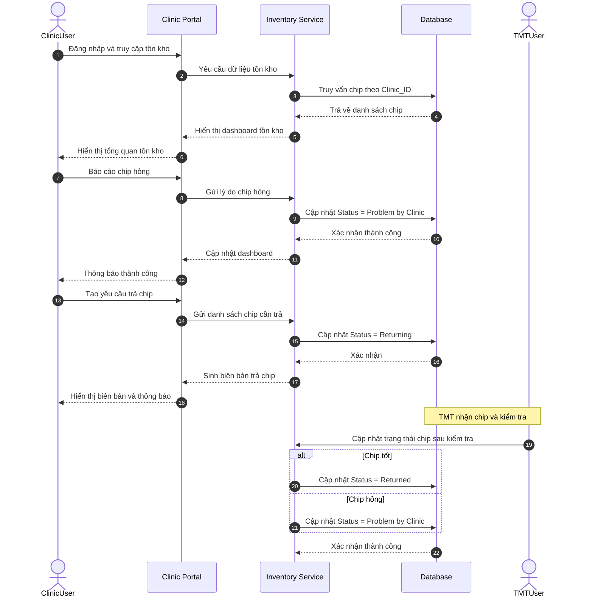

import { Steps } from "nextra/components";

# US-CLI-03: Tồn kho Chip định danh ở phòng khám

**Mô tả:** Là một người dùng tại phòng khám (Clinic), tôi muốn quản lý tồn kho chip định danh để theo dõi việc sử dụng, báo cáo sự cố, và xử lý trả về kho tổng, đảm bảo kiểm soát chặt chẽ số lượng chip đang quản lý.

### Điều kiện tiên quyết (Pre-conditions)

- Người dùng đã đăng nhập với quyền **Clinic**.
- Phòng khám đã nhận chip từ Admin (trạng thái `In-Clinic`).
- Hệ thống đã có dữ liệu chip được gán cho phòng khám này.

---

### Tiêu chí chấp nhận (Acceptance Criteria - AC)

#### Xem tồn kho tổng quan

- **Dashboard tồn kho:** Hiển thị bảng điều khiển tổng quan về chip đang quản lý tại phòng khám, **chỉ hiển thị chip thuộc clinic** với các trạng thái:
    - Tổng số chip đang có (chỉ chip thuộc clinic này)
    - Số chip đang gửi đến (`Sending-to-Clinic`) - đang chờ Clinic xác nhận đủ
    - Số chip chưa sử dụng (`In-Clinic`)
    - Số chip đã kích hoạt (`Activated`)
    - Số chip có vấn đề (`Problem by Clinic`)
    - Số chip đang trả về (`Returning`)
    - Số chip đã trả về (`Returned`)
- **Lưu ý quan trọng:** Clinic **KHÔNG** xem được:
    - Chip ở trạng thái `Available` (tại kho tổng Tomotek)
    - Chip ở trạng thái `Problem by TMT` hoặc `Problem by Factory`
    - Chip thuộc các clinic khác
- **Tìm kiếm và lọc:** Cho phép tìm kiếm theo `SN No.`, lọc theo trạng thái (chỉ các trạng thái được phép xem), hoặc theo khoảng thời gian nhận chip.

#### Theo dõi sử dụng chip

- **Lịch sử kích hoạt:** Hiển thị danh sách các chip đã được kích hoạt, bao gồm:
    - `SN No.` của chip
    - Ngày kích hoạt
    - ID thú cưng được gắn chip
    - Nhân viên thực hiện
- **Chi tiết sử dụng:** Khi click vào một chip đã kích hoạt, hiển thị thông tin hồ sơ thú cưng liên kết (ảnh định danh, thông tin tiêm, v.v.) theo quy trình định danh.

#### Quản lý sự cố và chip hỏng

- **Báo cáo sự cố:** Cho phép báo cáo chip bị hỏng, mất hoặc không sử dụng được.
- **Lý do sự cố:** Người dùng nhập lý do chip có vấn đề (ví dụ: hỏng kỹ thuật, mất, không tiêm được, v.v.).
- **Cập nhật trạng thái:** Chip được chuyển sang trạng thái `Problem by Clinic` và loại khỏi danh sách khả dụng.
- **Xác nhận:** Hệ thống yêu cầu xác nhận trước khi cập nhật trạng thái chip.

```mermaid
flowchart TD
    A[Clinic phát hiện chip hỏng/mất] --> B[Ghi nhận thông tin sự cố]
    B --> C[Nhập lý do chi tiết]
    C --> D[Admin xác nhận và cập nhật]
    D --> E[Chip chuyển sang Problem by Clinic]
    E --> F[Ghi nhận vào lịch sử audit]
    F --> G[Loại chip khỏi danh sách khả dụng]
```

#### Trả chip về kho tổng

- **Chọn chip trả về:** Cho phép chọn các chip `In-Clinic` (chưa sử dụng) để trả về kho tổng.
- **Tạo yêu cầu trả về:** Hệ thống tạo yêu cầu trả chip, bao gồm danh sách `SN No.` được chọn.
- **Cập nhật trạng thái:** Chip chuyển từ `In-Clinic` sang `Returning` (đang trong quá trình trả về).
- **Tài liệu trả về:** Hệ thống tự động sinh biên bản trả chip để đính kèm khi bàn giao vật lý.
- **Lưu ý:** Sau khi TMT nhận chip, TMT sẽ kiểm tra và cập nhật trạng thái:
    - Nếu chip tốt: chuyển từ `Returning` sang `Returned` (đã về kho TMT)
    - Nếu chip hỏng: chuyển từ `Returning` sang `Problem by Clinic`

#### Cảnh báo tồn kho

- **Cảnh báo hết chip:** Khi số lượng chip `In-Clinic` (chưa sử dụng) giảm xuống dưới ngưỡng quy định (ví dụ: < 5 chip), hệ thống hiển thị cảnh báo.
- **Cảnh báo chip lỗi:** Khi tỷ lệ chip `Problem by Clinic` vượt quá ngưỡng (ví dụ: > 10%), hệ thống cảnh báo để kiểm tra chất lượng.

---

### Quy trình vận hành (Workflow)

1.  **Truy cập:** Người dùng tại phòng khám đăng nhập và điều hướng đến màn hình Quản lý tồn kho.
2.  **Xem tổng quan:** Kiểm tra số lượng chip theo từng trạng thái.
3.  **Theo dõi sử dụng:** Xem lịch sử kích hoạt và chi tiết hồ sơ thú cưng.
4.  **Báo cáo sự cố:** Khi phát hiện chip hỏng, thực hiện báo cáo và cập nhật trạng thái.
5.  **Trả chip:** Khi có chip chưa sử dụng cần trả về, tạo yêu cầu trả chip.
6.  **Xuất báo cáo:** Tạo báo cáo tồn kho định kỳ để đối chiếu.

---

### Sơ đồ trình tự (Sequence Diagram)

---

### Báo cáo và đối soát (Reports & Reconciliation)

| Loại báo cáo            | Mục đích                                       |
| ----------------------- | ---------------------------------------------- |
| Báo cáo tồn kho định kỳ | Theo dõi biến động chip theo thời gian         |
| Báo cáo sử dụng chip    | Phân tích hiệu quả sử dụng chip tại phòng khám |
| Báo cáo chip hỏng       | Đánh giá chất lượng chip và quy trình xử lý    |
| Báo cáo trả về kho      | Đối chiếu số lượng chip trả về với kho tổng    |

---

### Quy tắc nghiệp vụ (Business Rules)

> [!WARNING]
>
> Các quy tắc dưới đây đảm bảo tính toàn vẹn dữ liệu tại phòng khám.

- **Phân quyền dữ liệu:** Clinic chỉ được xem và thao tác trên chip thuộc clinic của mình (trạng thái: `Sending-to-Clinic`, `In-Clinic`, `Activated`, `Problem by Clinic`, `Returning`, `Returned`).
- **Không xem được chip kho tổng:** Clinic không thể xem chip ở trạng thái `Available`, `Problem by TMT`, `Problem by Factory`.
- **Không xem chip clinic khác:** Clinic không thể xem hoặc thao tác chip thuộc các clinic khác.
- **Lịch sử Returned:** Clinic có thể xem các chip đã `Returned` (đã trả về kho TMT) của chính clinic đó để theo dõi lịch sử.
- Chip ở trạng thái `Activated` không thể chuyển về trạng thái khác.
- Chip ở trạng thái `Problem by Clinic` không thể được sử dụng cho thú cưng mới.
- **Quy trình gửi chip từ TMT:**
    - Khi TMT tạo đơn ký gửi, chip chuyển từ `Available` sang `Sending-to-Clinic`.
    - Khi Clinic nhận và kiểm tra đủ, chip chuyển từ `Sending-to-Clinic` sang `In-Clinic`.
    - **Xử lý thiếu hụt:** Nếu Clinic nhận thiếu, chip vẫn giữ ở `Sending-to-Clinic` để TMT gửi bù. Sau khi TMT gửi bù đủ, Clinic xác nhận → chip chuyển sang `In-Clinic`.
- **Quy trình trả chip:**
    - Chỉ chip ở trạng thái `In-Clinic` mới có thể được Clinic yêu cầu trả về kho tổng.
    - Khi Clinic tạo yêu cầu trả, chip chuyển từ `In-Clinic` sang `Returning`.
    - Trạng thái `Returned` chỉ được TMT thiết lập sau khi nhận và kiểm tra chip từ Clinic.
    - TMT có quyền chuyển chip từ `Returning` sang `Problem by Clinic` nếu phát hiện hỏng trong quá trình kiểm tra.
- Mỗi lần báo cáo sự cố phải có lý do cụ thể và được lưu vào lịch sử.
