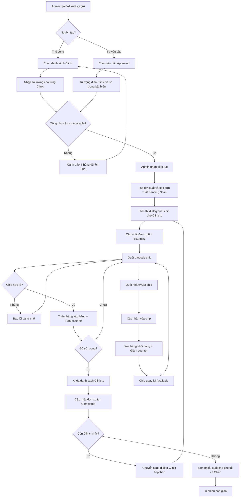
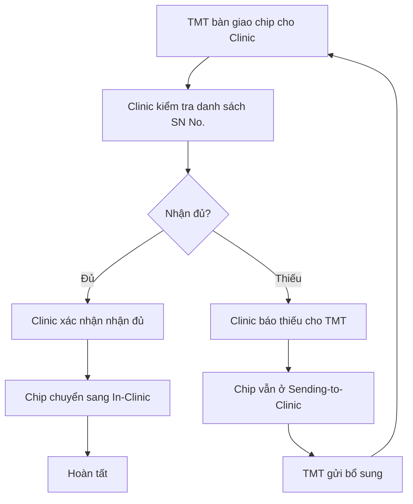
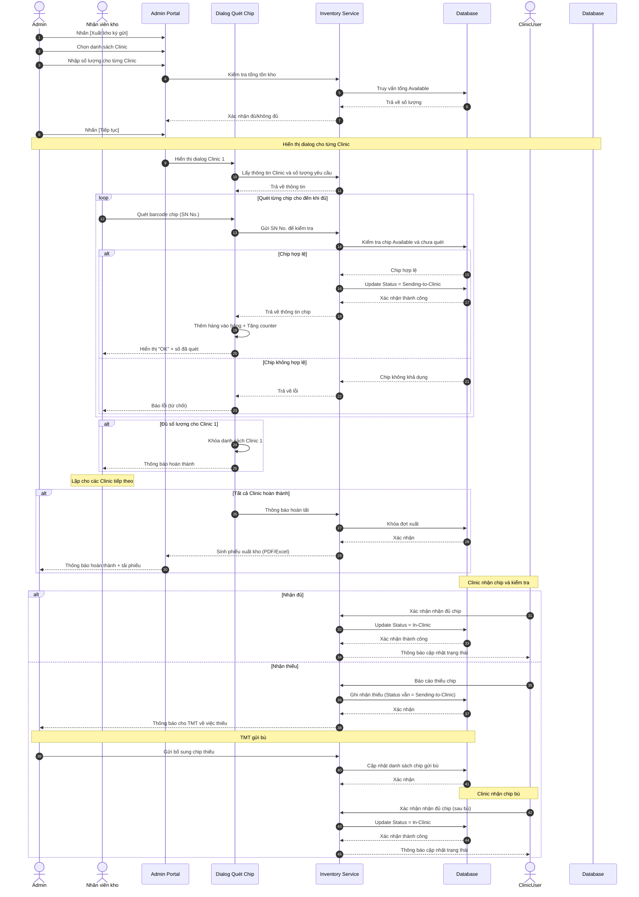

# US-ADM-07: Xuất kho ký gửi Chip cho Clinic

**Mô tả:** Là một Quản trị viên (Admin), tôi muốn tạo các đợt phân bổ chip để chuyển chip từ kho tổng đến phòng khám dưới hình thức ký gửi. Đợt xuất có thể được tạo thủ công hoặc từ các yêu cầu nhận ký gửi của Clinic. Sau khi chốt đợt, nhân viên kho sẽ sử dụng máy quét barcode để quét từng chip cho mỗi Clinic thông qua dialog quét chip.

### Điều kiện tiên quyết (Pre-conditions)

- Người dùng đã đăng nhập với quyền **Central Admin**.
- Các Clinic nhận hàng đã được khởi tạo và ở trạng thái hoạt động trên hệ thống.
- Kho tổng có đủ số lượng chip ở trạng thái **"Available"**.
- Nếu tạo đợt xuất từ yêu cầu: Các yêu cầu phải ở trạng thái `Approved`.

---

### Tiêu chí chấp nhận (Acceptance Criteria - AC)

#### Khởi tạo đợt phân bổ (Create Export Round)

- **Điểm kích hoạt:** Tại màn hình Quản lý Kho Chip, Admin nhấn nút **[Xuất kho ký gửi]**.
- **Nguồn đợt xuất:** Hệ thống cho phép chọn nguồn tạo đợt:
    - **Thủ công:** Admin tự chọn Clinic và nhập số lượng.
    - **Từ yêu cầu:** Admin chọn các yêu cầu `Approved` để tự động tạo đợt xuất.
- **Thông tin đợt xuất:** Hệ thống hiển thị form khởi tạo bao gồm:
    - **Tên/Mã đợt xuất:** Tự động sinh (ví dụ: EXP-YYYYMMDD-XXX)
    - **Ngày xuất:** Mặc định là ngày hiện tại.
    - **Nguồn tạo:** Hiển thị "Thủ công" hoặc "Từ yêu cầu" với danh sách mã yêu cầu liên kết.

#### Chọn danh sách Clinic và nhập số lượng

##### Trường hợp 1: Tạo thủ công (Manual Creation)

- **Chọn Clinic:** Hệ thống hiển thị danh sách tất cả Clinic hoạt động để Admin chọn (multi-select).
- **Nhập số lượng:** Với mỗi Clinic đã chọn, hệ thống hiển thị ô nhập số lượng chip cần ký gửi.
    - **Không bắt buộc bội số của 5**: Admin có thể nhập bất kỳ số lượng hợp lệ nào.
- **Kiểm tra tổng tồn:** Hệ thống tính toán tổng nhu cầu của đợt xuất. Nếu **Tổng nhu cầu > Tổng tồn Available**, hệ thống hiển thị cảnh báo và không cho phép tiếp tục.

##### Trường hợp 2: Tạo từ yêu cầu (From Requests)

- **Tự động điền Clinic:** Hệ thống tự động điền danh sách Clinic từ các yêu cầu `Approved` đã chọn.
- **Số lượng bất biến:** Số lượng chip cho mỗi Clinic **không thể chỉnh sửa**, phải khớp với số lượng đã duyệt trong yêu cầu.
- **Hiển thị thông tin yêu cầu:** Bên cạnh mỗi Clinic, hiển thị mã yêu cầu liên kết (ví dụ: `REQ-20260405-001`).
- **Kiểm tra tổng tồn:** Hệ thống tính toán tổng nhu cầu. Nếu **Tổng nhu cầu > Tổng tồn Available**, hệ thống hiển thị cảnh báo và không cho phép tiếp tục.

---

#### Trạng thái đơn xuất ký gửi (Export Order Status)

Mỗi Clinic trong đợt xuất có một **đơn xuất ký gửi** với trạng thái riêng để theo dõi tiến độ:

| Trạng thái           | Ý nghĩa                                            |
| -------------------- | -------------------------------------------------- |
| `Pending Scan`       | Chưa bắt đầu quét, chờ warehouse mở dialog quét    |
| `Scanning`           | Đang trong quá trình quét chip cho Clinic này      |
| `Completed`          | Đã quét đủ số lượng chip, sẵn sàng bàn giao        |
| `Partially Received` | Clinic đã nhận nhưng báo thiếu                     |
| `Fully Received`     | Clinic đã xác nhận nhận đủ chip                    |
| `Cancelled`          | Đơn xuất bị hủy (do Admin hoặc Clinic hủy yêu cầu) |

---

#### Quét chip xuất kho bằng Barcode Scanner (Barcode Scanning Process)

Sau khi Admin nhấn **Tiếp tục**, hệ thống hiển thị **dialog quét chip cho từng Clinic**. Với mỗi Clinic:

- **Dialog quét chip:** Hệ thống hiển thị dialog riêng cho từng Clinic với thông tin:
    - **Tên Clinic** đang quét.
    - **Tiến độ quét:** Số chip đã quét / Số lượng yêu cầu (ví dụ: `3/10`).
    - **Bảng danh sách chip đã quét:** Hiển thị các `SN No.` đã quét thành công.
    - **Khu vực quét:** Một ô input tự động focus, sẵn sàng nhận dữ liệu từ máy quét barcode.

- **Quy trình quét:**
    1. Nhân viên kho sử dụng máy quét barcode để quét từng chip (`SN No.`).
    2. Máy quét sẽ tự động điền `SN No.` vào ô input và submit (mô phỏng hành vi nhập liệu nhanh).
    3. Hệ thống **kiểm tra hợp lệ** ngay lập tức:
        - Chip phải ở trạng thái `Available`.
        - Chip chưa được quét cho đợt này hoặc bất kỳ đợt nào khác.
        - Chip không thuộc trạng thái `Problem by ...`.
    4. **Nếu hợp lệ:**
        - Hệ thống **thêm một hàng** vào bảng danh sách chip gửi đi.
        - **Tăng số lượng đã quét +1**.
        - Chuyển chip sang trạng thái `Sending-to-Clinic`.
        - Cập nhật trạng thái đơn xuất sang `Scanning`.
    5. **Nếu không hợp lệ:** Hệ thống hiển thị thông báo lỗi rõ ràng (ví dụ: "Chip không khả dụng", "Chip đã được quét trước đó") và từ chối ghi nhận.

- **Xóa chip đã quét:** Trong quá trình quét, nhân viên kho có thể xóa một chip đã quét khỏi danh sách:
    - **Cách thực hiện:** Trong bảng danh sách chip đã quét, mỗi hàng có nút **[Xóa]** (icon thùng rác).
    - **Xác nhận xóa:** Khi nhấn [Xóa], hệ thống hiển thị dialog xác nhận: "Bạn có chắc muốn xóa chip `SN No. XXX` khỏi danh sách?"
    - **Khi xóa thành công:**
        - Chip bị **xóa khỏi bảng** danh sách chip gửi đi.
        - Số lượng đã quét **giảm -1**.
        - Chip quay lại trạng thái `Available` (để có thể quét lại hoặc xuất cho đợt khác).
        - Đơn xuất **quay lại `Scanning`** nếu đã `Completed` (nếu số lượng đã quét < số lượng yêu cầu).
    - **Ràng buộc:**
        - Chỉ được xóa khi đơn xuất **chưa bàn giao** cho Clinic (trạng thái `Pending Scan` hoặc `Scanning`).
        - Không được xóa khi đơn xuất đã `Completed` và Clinic đã xác nhận nhận chip.

- **Hoàn thành Clinic:** Khi đã quét đủ số lượng chip cho một Clinic, hệ thống:
    - Tự động **khóa danh sách** của Clinic đó (không cho quét thêm).
    - Cập nhật trạng thái đơn xuất sang `Completed`.
    - Hiển thị thông báo hoàn thành.
    - Cho phép chuyển sang dialog của Clinic tiếp theo.

- **In ấn và truy xuất:**
    - Sau khi hoàn tất tất cả Clinic trong đợt, hệ thống hỗ trợ in hoặc xuất file (PDF/Excel) danh sách `SN No.` theo từng Clinic để đính kèm vào biên bản bàn giao vật lý.
    - Lịch sử đợt xuất: Admin có thể xem lại thông tin chi tiết các đợt xuất cũ, bao gồm danh sách chip đã quét cho từng Clinic.

---

#### Chốt đợt và Cập nhật trạng thái (Commit & Status Update)

- **Xác nhận hoàn thành:** Khi tất cả Clinic trong đợt đã quét đủ số lượng, hệ thống tự động khóa toàn bộ đợt xuất.
- **Cập nhật dữ liệu:**
    - Trạng thái của các chip đã quét chuyển từ `Available` sang **`Sending-to-Clinic`**.
    - Ghi nhận thông tin Clinic sở hữu tạm thời cho từng mã chip.
- **Sinh phiếu bàn giao:** Hệ thống tự động tạo các **Phiếu xuất kho ký gửi** tương ứng cho từng Clinic. Mỗi phiếu bao gồm thông tin: Tên Clinic, Mã đợt, Tổng số lượng và Danh sách chi tiết các mã `SN No.` đã quét.

### Sơ đồ luồng xuất kho ký gửi (Flowchart)

### Sơ đồ luồng nhận chip tại Clinic

---

### Quy trình vận hành (Workflow)

#### Trường hợp 1: Tạo đợt xuất thủ công (Manual Export)

1.  **Khởi tạo:** Admin nhấn [Xuất kho ký gửi] và chọn nguồn "Thủ công".
2.  **Chọn Clinic:** Chọn danh sách Clinic nhận hàng.
3.  **Nhập số lượng:** Nhập số lượng chip cần ký gửi cho từng Clinic (không bắt buộc bội số của 5).
4.  **Kiểm tra tồn kho:** Hệ thống kiểm tra tổng nhu cầu không vượt quá tồn kho Available.
5.  **Tạo đợt:** Admin nhấn [Tiếp tục], hệ thống tạo đợt xuất với trạng thái `Draft`.

#### Trường hợp 2: Tạo đợt xuất từ yêu cầu (Export from Requests)

1.  **Chọn yêu cầu:** Admin chọn các yêu cầu `Approved` từ danh sách yêu cầu.
2.  **Tự động điền:** Hệ thống tự động điền Clinic và số lượng **bất biến** (không thể chỉnh sửa).
3.  **Kiểm tra tồn kho:** Hệ thống kiểm tra tổng nhu cầu không vượt quá tồn kho Available.
4.  **Tạo đợt:** Admin nhấn [Tiếp tục], hệ thống tạo đợt xuất với trạng thái `Draft` và liên kết với các yêu cầu.

#### Quét chip và hoàn tất (Scanning & Completion)

5.  **Quét chip:** Hệ thống hiển thị dialog quét chip cho từng Clinic:
    - Với mỗi Clinic, nhân viên kho quét từng `SN No.` bằng barcode scanner.
    - Mỗi lần quét thành công: hệ thống thêm 1 hàng vào bảng và tăng số lượng đã quét +1.
    - Cập nhật trạng thái đơn xuất sang `Scanning`.
    - Khi đủ số lượng, hệ thống tự động khóa danh sách và cập nhật đơn xuất sang `Completed`.
    - Chuyển sang dialog của Clinic tiếp theo cho đến khi hoàn tất.
6.  **In ấn:** Hệ thống sinh và cho phép in phiếu danh sách `SN No.` đã quét cho từng Clinic.
7.  **Nhận chip:** Clinic nhận chip và kiểm tra danh sách:
    - **Nếu nhận đủ:** Clinic xác nhận → đơn xuất chuyển sang `Fully Received`, yêu cầu (nếu có) chuyển sang `Fulfilled`.
    - **Nếu nhận thiếu:** Clinic báo thiếu → đơn xuất chuyển sang `Partially Received`, chip vẫn ở `Sending-to-Clinic` để TMT gửi bù.
8.  **Gửi bù (nếu thiếu):** TMT gửi bổ sung chip thiếu → Clinic nhận đủ và xác nhận → đơn xuất chuyển sang `Fully Received`.

---

### Sơ đồ trình tự (Sequence Diagram)

