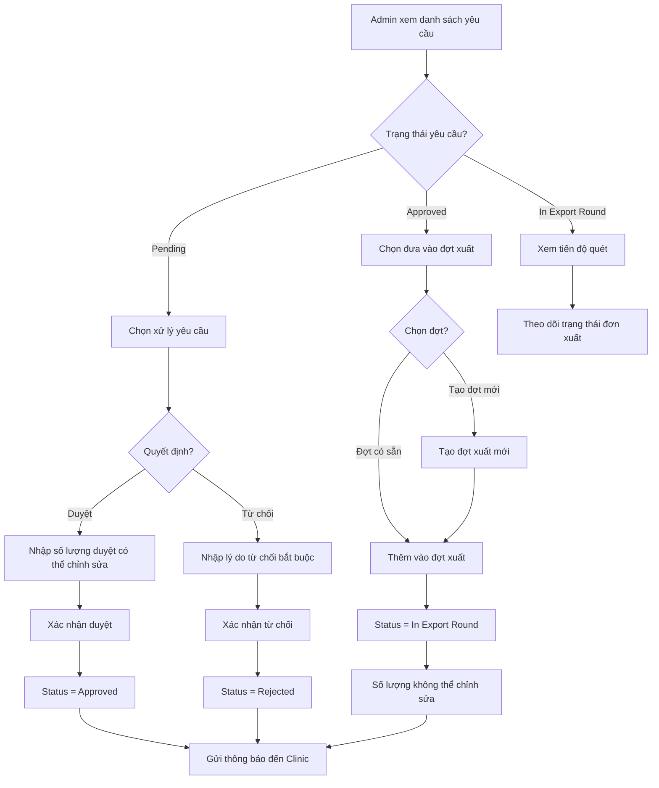
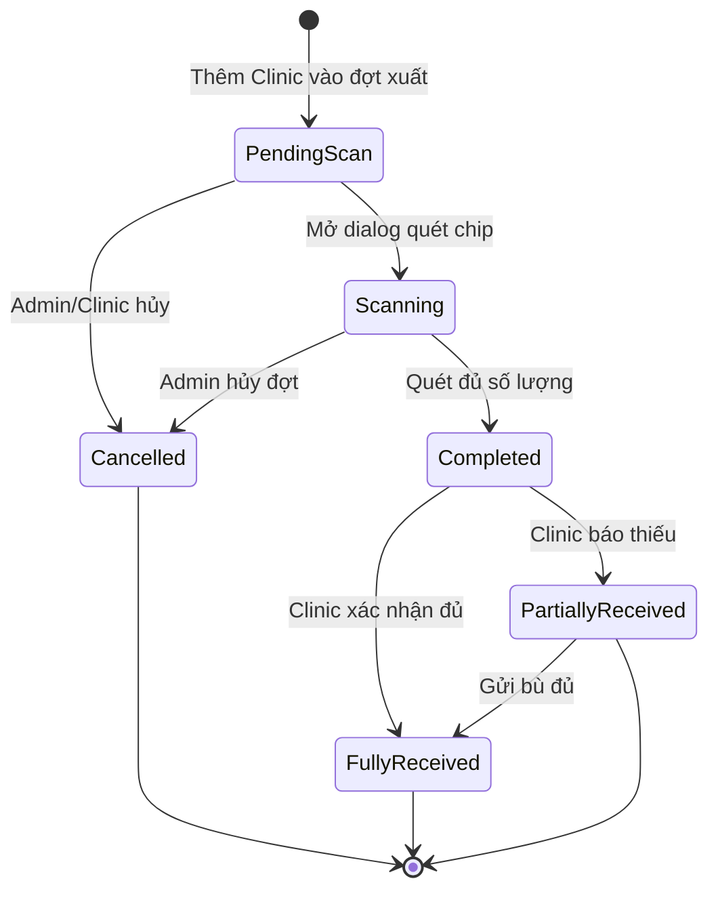
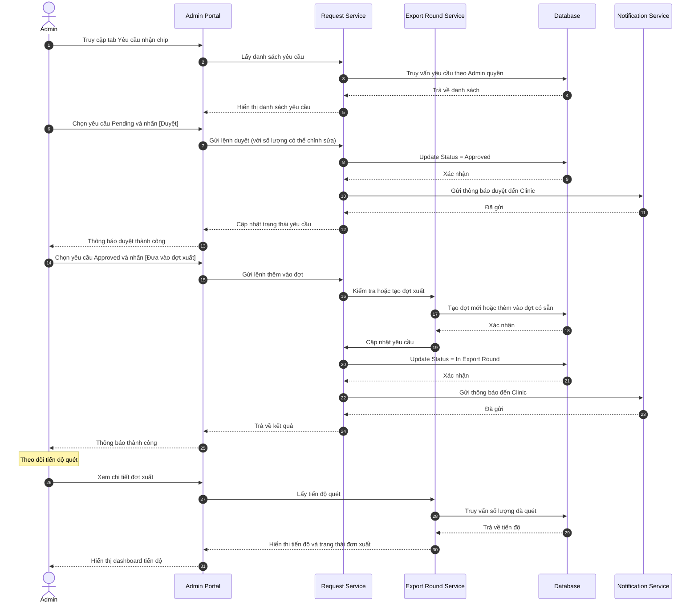

# US-ADM-09: Xử lý yêu cầu nhận ký gửi từ Clinic

**Mô tả:** Là một Quản trị viên (Admin), tôi muốn xem và xử lý các yêu cầu nhận chip ký gửi từ Clinic để có thể lên kế hoạch xuất kho hàng loạt, đảm bảo đáp ứng nhu cầu chip của các phòng khám một cách chủ động.

### Điều kiện tiên quyết (Pre-conditions)

- Người dùng đã đăng nhập với quyền **Central Admin**.
- Có ít nhất một Clinic đã tạo yêu cầu nhận ký gửi trên hệ thống.

---

### Tiêu chí chấp nhận (Acceptance Criteria - AC)

#### Xem danh sách yêu cầu (View Request List)

- **Điểm truy cập:** Tại màn hình Quản lý Kho Chip, Admin có tab **[Yêu cầu nhận chip]** hiển thị danh sách yêu cầu từ Clinic.
- **Thông tin hiển thị:** Bảng danh sách bao gồm các cột:
    - **Mã yêu cầu:** (ví dụ: REQ-YYYYMMDD-XXX)
    - **Tên Clinic:** Clinic tạo yêu cầu.
    - **Ngày tạo:** Thời điểm tạo yêu cầu.
    - **Số lượng yêu cầu:** Số chip mà Clinic yêu cầu.
    - **Lý do yêu cầu:** Lý do Clinic cần chip.
    - **Ngày mong nhận:** Ngày Clinic mong muốn nhận được chip.
    - **Trạng thái:** `Pending`, `Approved`, `In Export Round`, `Fulfilled`, `Rejected`, `Cancelled`.
    - **Hành động:** Nút xử lý (duyệt/từ chối) tùy theo trạng thái.

#### Lọc và tìm kiếm (Filter & Search)

- **Lọc theo trạng thái:** Admin có thể lọc yêu cầu theo trạng thái (Pending, Approved, Rejected, v.v.).
- **Lọc theo Clinic:** Chọn Clinic cụ thể để xem yêu cầu.
- **Tìm kiếm:** Tìm theo mã yêu cầu, tên Clinic, hoặc ghi chú.

#### Xử lý yêu cầu Pending (Process Pending Requests)

Khi Admin chọn một yêu cầu ở trạng thái `Pending`, hệ thống hiển thị dialog xử lý với các tùy chọn:

##### Tùy chọn 1: Duyệt yêu cầu (Approve)

- **Xác nhận số lượng:**
    - **Mặc định:** Số lượng hiển thị bằng với số lượng Clinic yêu cầu.
    - **Có thể chỉnh sửa:** Admin có thể nhập số lượng **khác** với yêu cầu (tùy theo tồn kho thực tế).
- **Ghi chú phê duyệt:** Admin có thể nhập ghi chú (optional).
- **Xác nhận:** Khi nhấn **[Duyệt]**, hệ thống:
    - Chuyển trạng thái yêu cầu sang **`Approved`**.
    - Gửi thông báo duyệt đến Clinic.

##### Tùy chọn 2: Từ chối yêu cầu (Reject)

- **Lý do từ chối:** Bắt buộc nhập lý do từ chối.
- **Xác nhận:** Khi nhấn **[Từ chối]**, hệ thống:
    - Chuyển trạng thái yêu cầu sang **`Rejected`**.
    - Gửi thông báo từ chối kèm lý do đến Clinic.

##### Tùy chọn 3: Đưa vào đợt xuất (Add to Export Round)

- **Yêu cầu đã duyệt:** Chỉ hiển thị các yêu cầu đã `Approved` để đưa vào đợt xuất.
- **Chọn hoặc tạo đợt xuất:**
    - **Chọn đợt có sẵn:** Admin chọn một đợt xuất đang ở trạng thái `Draft` (nháp).
    - **Tạo đợt mới:** Admin nhấn [Tạo đợt mới] để tạo đợt xuất mới và tự động thêm Clinic này vào.
- **Không cho chỉnh sửa số lượng:** Khi đưa yêu cầu vào đợt xuất, số lượng chip cho Clinic này **không thể chỉnh sửa** (phải khớp với số lượng đã duyệt).
- **Xác nhận:** Khi nhấn **[Thêm vào đợt]**, hệ thống:
    - Chuyển trạng thái yêu cầu sang **`In Export Round`**.
    - Tự động thêm Clinic vào đợt xuất với số lượng đã duyệt.
    - Gửi thông báo đến Clinic về việc yêu cầu đã được đưa vào đợt xuất.

---

#### Tạo đợt xuất hàng loạt từ các yêu cầu (Create Export Round from Requests)

- **Điểm kích hoạt:** Tại danh sách yêu cầu, Admin nhấn nút **[Tạo đợt xuất từ yêu cầu]**.
- **Chọn yêu cầu:** Admin chọn nhiều yêu cầu đã `Approved` để đưa vào cùng một đợt xuất.
- **Thông tin đợt xuất:**
    - **Tên/Mã đợt:** Tự động sinh.
    - **Danh sách Clinic:** Tự động điền từ các yêu cầu đã chọn.
    - **Số lượng mỗi Clinic:** Tự động điền từ số lượng đã duyệt (**không cho chỉnh sửa**).
- **Kiểm tra tồn kho:** Hệ thống kiểm tra tổng nhu cầu không vượt quá tồn kho `Available`.
- **Tạo đợt:** Khi nhấn **[Tạo đợt]**, hệ thống:
    - Tạo đợt xuất mới với trạng thái `Draft`.
    - Tự động thêm các Clinic và số lượng tương ứng.
    - Chuyển tất cả yêu cầu đã chọn sang `In Export Round`.

---

#### Theo dõi tiến độ đợt xuất (Track Export Round Progress)

- **Chi tiết đợt xuất:** Admin có thể xem chi tiết đợt xuất với thông tin:
    - **Trạng thái đợt xuất:** `Draft`, `Scanning`, `Completed`, `Cancelled`.
    - **Danh sách Clinic:** Trong đợt xuất với số lượng yêu cầu và số lượng đã quét.
    - **Tiến độ quét:** Số chip đã quét / Tổng số lượng yêu cầu cho mỗi Clinic.
- **Trạng thái từng đơn xuất (Export Order Status):** Mỗi Clinic trong đợt xuất có một đơn xuất ký gửi với trạng thái riêng:

| Trạng thái đơn xuất  | Ý nghĩa                                         |
| -------------------- | ----------------------------------------------- |
| `Pending Scan`       | Chưa bắt đầu quét, chờ warehouse mở dialog quét |
| `Scanning`           | Đang trong quá trình quét chip                  |
| `Completed`          | Đã quét đủ số lượng chip, sẵn sàng bàn giao     |
| `Partially Received` | Clinic đã nhận nhưng báo thiếu                  |
| `Fully Received`     | Clinic đã xác nhận nhận đủ chip                 |
| `Cancelled`          | Đơn xuất bị hủy (do Admin)                      |

---

### Sơ đồ luồng xử lý yêu cầu (Flowchart)

---

### Sơ đồ trạng thái đơn xuất ký gửi (Export Order Status Flow)

---

### Quy trình vận hành (Workflow)

1.  **Xem yêu cầu:** Admin vào tab [Yêu cầu nhận chip] để xem danh sách yêu cầu từ Clinic.
2.  **Lọc và tìm kiếm:** Lọc theo trạng thái, Clinic hoặc tìm kiếm theo mã yêu cầu.
3.  **Xử lý yêu cầu Pending:**
    - **Duyệt:** Xác nhận số lượng (có thể điều chỉnh) → `Approved`.
    - **Từ chối:** Nhập lý do → `Rejected`.
4.  **Đưa vào đợt xuất:**
    - Chọn yêu cầu `Approved` → đưa vào đợt xuất có sẵn hoặc tạo mới.
    - Số lượng **không thể chỉnh sửa** khi đã đưa vào đợt xuất.
    - Yêu cầu chuyển sang `In Export Round`.
5.  **Tạo đợt xuất hàng loạt:** Chọn nhiều yêu cầu `Approved` → tạo đợt xuất tự động.
6.  **Quét chip:** Warehouse thực hiện quét chip theo dialog cho từng Clinic.
7.  **Theo dõi:** Admin xem tiến độ quét và trạng thái từng đơn xuất ký gửi.
8.  **Hoàn tất:** Khi Clinic nhận đủ chip → đơn xuất chuyển sang `Fully Received`, yêu cầu chuyển sang `Fulfilled`.

---

### Sơ đồ trình tự (Sequence Diagram)

---

### Quy tắc nghiệp vụ (Business Rules)

> [!WARNING]
>
> Các quy tắc dưới đây đảm bảo tính toàn vẹn dữ liệu cho quy trình xử lý yêu cầu.

- **Số lượng bất biến trong đợt xuất:** Khi yêu cầu đã được đưa vào đợt xuất, số lượng chip cho Clinic đó **không thể chỉnh sửa** (phải khớp với số lượng đã duyệt).
- **Một đợt xuất có thể có nhiều Clinic:** Một đợt xuất ký gửi có thể bao gồm nhiều Clinic, mỗi Clinic có một đơn xuất riêng.
- **Chỉ đưa yêu cầu Approved vào đợt xuất:** Yêu cầu phải ở trạng thái `Approved` mới được phép đưa vào đợt xuất.
- **Ưu tiên xử lý theo thứ tự:** Admin có thể ưu tiên xử lý các yêu cầu có ngày mong nhận gần nhất hoặc lý do khẩn cấp.
- **Không hủy đợt xuất có đơn xuất đã quét:** Đợt xuất đã có đơn xuất ở trạng thái `Scanning` hoặc `Completed` **không thể hủy**. Chỉ có thể hủy khi tất cả đơn xuất đều `Pending Scan`.
- **Yêu cầu tự động Fulfilled:** Khi Clinic xác nhận nhận đủ chip (đơn xuất `Fully Received`), yêu cầu tự động chuyển sang `Fulfilled`.
- **Audit log:** Mọi thao tác xử lý yêu cầu (duyệt, từ chối, đưa vào đợt xuất) đều được lưu vết với thông tin: người thực hiện, thời gian, ghi chú.

---

### Bảng ví dụ luồng trạng thái (Status Flow Example)

| Thời điểm     | Trạng thái yêu cầu | Trạng thái đơn xuất | Ghi chú                             |
| ------------- | ------------------ | ------------------- | ----------------------------------- |
| Ngày 01       | `Pending`          | -                   | Clinic tạo yêu cầu 20 chip          |
| Ngày 02       | `Approved`         | -                   | Admin duyệt với số lượng 20 chip    |
| Ngày 05       | `In Export Round`  | `Pending Scan`      | Admin đưa vào đợt EXP-20260405-001  |
| Ngày 05 (sau) | `In Export Round`  | `Scanning`          | Warehouse đang quét chip cho Clinic |
| Ngày 05 (sau) | `In Export Round`  | `Completed`         | Quét đủ 20 chip                     |
| Ngày 07       | `Fulfilled`        | `Fully Received`    | Clinic xác nhận nhận đủ chip        |
