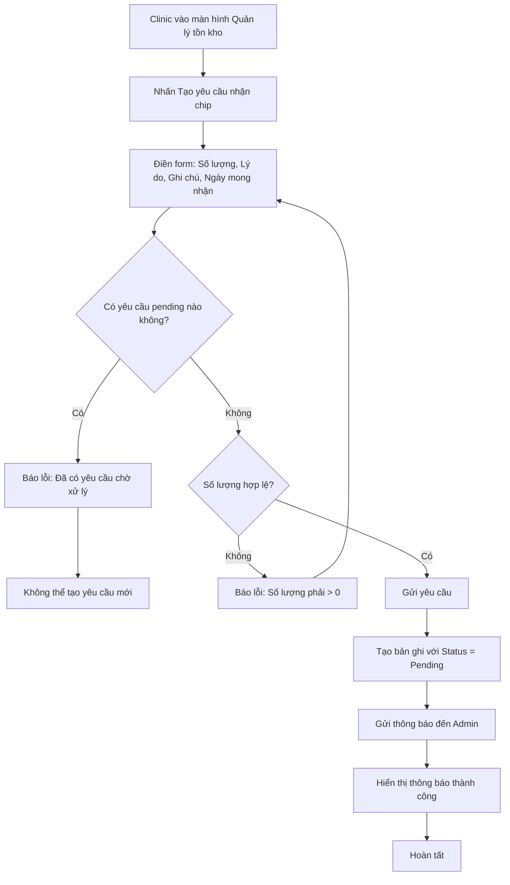
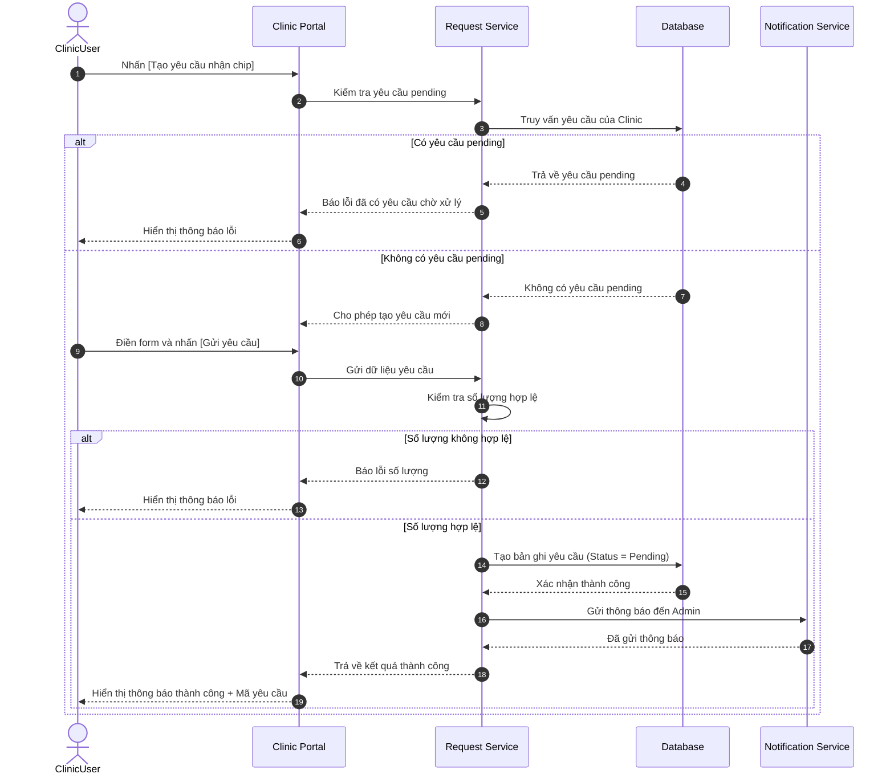

# US-CLI-08: Tạo yêu cầu nhận ký gửi Chip từ Clinic

**Mô tả:** Là một người dùng tại phòng khám (Clinic), tôi muốn tạo yêu cầu nhận chip ký gửi để gửi yêu cầu đến kho tổng về số lượng chip cần bổ sung, giúp Admin biết chính xác số lượng cần xuất cho từng Clinic trong đợt xuất hàng loạt.

### Điều kiện tiên quyết (Pre-conditions)

- Người dùng đã đăng nhập với quyền **Clinic**.
- Phòng khám đang ở trạng thái hoạt động trên hệ thống.
- Clinic chưa có yêu cầu chờ xử lý (pending) nào khác.

---

### Tiêu chí chấp nhận (Acceptance Criteria - AC)

#### Tạo yêu cầu nhận ký gửi (Create Consignment Request)

- **Điểm kích hoạt:** Tại màn hình Quản lý tồn kho Chip, Clinic nhấn nút **[Tạo yêu cầu nhận chip]**.
- **Form yêu cầu:** Hệ thống hiển thị form bao gồm:
    - **Số lượng chip yêu cầu:** Clinic nhập số lượng chip cần nhận ký gửi (bất kỳ số hợp lệ nào, không bắt buộc bội số của 5).
    - **Lý do yêu cầu:** Dropdown chọn lý do (ví dụ: "Sắp hết hàng", "Bổ sung định kỳ", "Có sự kiện tiêm chủng", "Lý do khác").
    - **Ghi chú:** Trường text nhập thêm thông tin chi tiết (optional).
    - **Ngày mong nhận:** Clinic chọn ngày mong muốn nhận được chip (default là ngày hiện tại + 3 ngày).

#### Kiểm tra ràng buộc (Validation Rules)

- **Số lượng hợp lệ:** Phải là số nguyên dương (> 0).
- **Không trùng lặp:** Clinic chỉ có thể tạo **một yêu cầu pending** tại một thời điểm. Nếu đã có yêu cầu pending chưa được xử lý, hệ thống hiển thị thông báo: "Bạn đã có yêu cầu chờ xử lý từ ngày [date]. Vui lòng đợi Admin xử lý trước khi tạo yêu cầu mới."
- **Trạng thái yêu cầu cũ:** Nếu yêu cầu trước đó đã bị **Từ chối (Rejected)** hoặc **Đã xử lý (Fulfilled)**, Clinic được phép tạo yêu cầu mới.

#### Gửi yêu cầu (Submit Request)

- Sau khi nhấn **[Gửi yêu cầu]**, hệ thống:
    - Tạo bản ghi yêu cầu với trạng thái **`Pending`**.
    - Gửi thông báo đến Admin về yêu cầu mới.
    - Hiển thị thông báo thành công cho Clinic.

#### Quản lý yêu cầu đã tạo (Request Management)

- **Danh sách yêu cầu:** Clinic xem được lịch sử tất cả yêu cầu đã tạo với thông tin:
    - **Mã yêu cầu:** Tự động sinh (ví dụ: REQ-YYYYMMDD-XXX).
    - **Ngày tạo:** Thời điểm tạo yêu cầu.
    - **Số lượng yêu cầu:** Số chip đã yêu cầu.
    - **Trạng thái:** `Pending`, `Approved`, `In Export Round`, `Fulfilled`, `Rejected`.
    - **Phản hồi của Admin:** (nếu có).
- **Hủy yêu cầu:** Clinic có thể **hủy yêu cầu pending** nếu chưa được Admin xử lý.

---

### Trạng thái yêu cầu (Request Status Lifecycle)

| Trạng thái         | Ý nghĩa                                                                                        |
| ------------------ | ---------------------------------------------------------------------------------------------- |
| `Pending`          | Yêu cầu đã được tạo, chờ Admin xử lý                                                           |
| `Approved`         | Admin đã duyệt yêu cầu, chờ đưa vào đợt xuất                                                   |
| `In Export Round`  | Yêu cầu đã được đưa vào đợt xuất ký gửi, đang trong quá trình quét chip                        |
| `Fulfilled`        | Clinic đã nhận đủ chip từ đợt xuất                                                             |
| `Rejected`         | Admin từ chối yêu cầu (kèm lý do)                                                              |
| `Cancelled`        | Clinic tự hủy yêu cầu pending                                                                  |

---

### Sơ đồ luồng tạo yêu cầu (Flowchart)

---

### Quy trình vận hành (Workflow)

1.  **Truy cập:** Clinic đăng nhập và điều hướng đến màn hình Quản lý tồn kho Chip.
2.  **Tạo yêu cầu:** Nhấn [Tạo yêu cầu nhận chip] và điền thông tin.
3.  **Kiểm tra:** Hệ thống kiểm tra ràng buộc (không có yêu cầu pending, số lượng hợp lệ).
4.  **Gửi:** Clinic gửi yêu cầu, hệ thống lưu với trạng thái `Pending`.
5.  **Chờ xử lý:** Admin nhận thông báo và xử lý yêu cầu (duyệt/từ chối/đưa vào đợt xuất).
6.  **Theo dõi:** Clinic xem trạng thái yêu cầu trong danh sách yêu cầu đã tạo.

---

### Sơ đồ trình tự (Sequence Diagram)

---

### Quy tắc nghiệp vụ (Business Rules)

> [!WARNING]
>
> Các quy tắc dưới đây đảm bảo tính toàn vẹn dữ liệu cho quy trình yêu cầu.

- **Một yêu cầu pending tại một thời điểm:** Clinic chỉ có thể có tối đa **một** yêu cầu ở trạng thái `Pending`.
- **Không sửa yêu cầu pending:** Sau khi gửi yêu cầu, Clinic **không thể chỉnh sửa** yêu cầu pending. Nếu muốn thay đổi, phải hủy yêu cầu cũ và tạo yêu cầu mới.
- **Admin quyết định số lượng thực tế:** Admin có thể duyệt yêu cầu với số lượng **khác** với số lượng yêu cầu (thấp hơn hoặc cao hơn) tùy theo tồn kho thực tế.
- **Bắt buộc xử lý theo thứ tự:** Yêu cầu phải đi qua các trạng thái theo thứ tự: `Pending` → `Approved` → `In Export Round` → `Fulfilled`.
- **Yêu cầu bị từ chối:** Khi Admin từ chối yêu cầu, phải nhập **lý do từ chối**. Clinic có thể xem lý do này trong danh sách yêu cầu.
- **Tự động hủy khi Clinic đóng:** Nếu Clinic bị vô hiệu hóa trên hệ thống, tất cả yêu cầu pending của Clinic đó sẽ tự động chuyển sang `Cancelled`.

---

### Bảng ví dụ luồng trạng thái (Status Flow Example)

| Thời điểm      | Trạng thái         | Ghi chú                                           |
| -------------- | ------------------ | ------------------------------------------------- |
| Ngày 01        | `Pending`          | Clinic tạo yêu cầu 20 chip                        |
| Ngày 02        | `Approved`         | Admin duyệt yêu cầu với số lượng 20 chip          |
| Ngày 05        | `In Export Round`  | Admin đưa yêu cầu vào đợt xuất EXP-20260405-001   |
| Ngày 05 (sau)  | `Fulfilled`        | Warehouse quét đủ 20 chip, Clinic nhận đủ         |
| Ngày 10        | `Pending`          | Clinic tạo yêu cầu mới (yêu cầu trước đã hoàn thành) |
